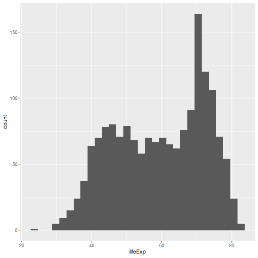
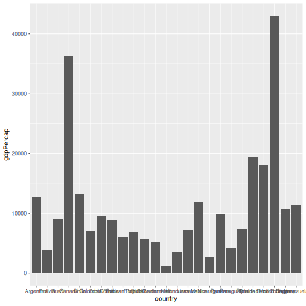
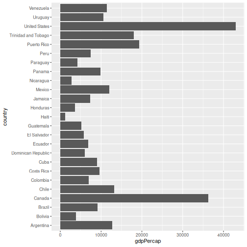
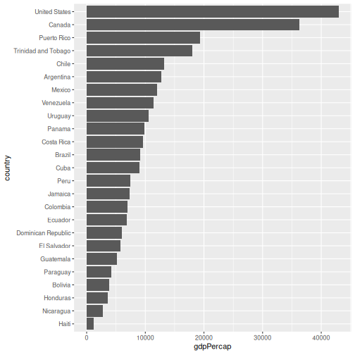
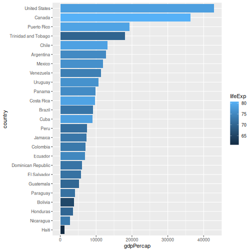
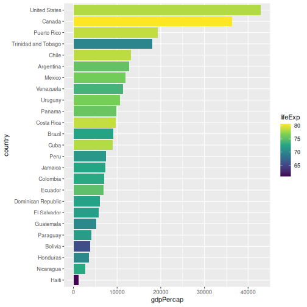
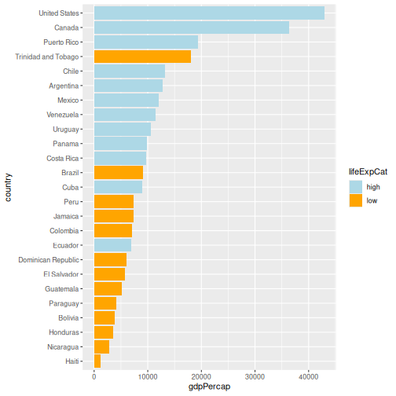

:::::::::::::::::::::::::::::::::::::: questions 

- How can I create a basic plot in R?
- How can I add features to a plot?
- How can I get basic summary information about my data set?
- How can I include addition information via a colours palette. 
- How can I find more information about a function and its arguments? 
- How can I create new columns or remove existing columns from a data frame?

::::::::::::::::::::::::::::::::::::::::::::::::

::::::::::::::::::::::::::::::::::::: objectives

After completing this episode, participants should be able to…

- Generate plots to visualise data with `ggplot2`.
- Add plot layers to incrementally build a more complex plot.
- Use the `fill` argument for colouring surfaces, and modify colours with the viridis or scale_manual packages. 
- Explore the help documentation.
- Save and format your plot via the `ggsave()` function.  

::::::::::::::::::::::::::::::::::::::::::::::::

# Introduction to Visualisation

The package `ggplot2` is a powerful plotting system. We will start with an introduction of key features of `ggplot2`.  `gg` stands for grammar of graphics. The idea idea behind it is that the following three components are needed to create a graph: 

- data,
- aesthetics - a coordinate system on which we map the data
(what is represented on x axis, what on y axis), and
- geometries - visual representation of the data (points, bars, etc.)

A fun part about `ggplot2` is that you can add layers to the plot to provide more information and to make it more beautiful.

In the following parts of this workshop, you will use this package to visualize geospatial data. First, make sure that you have the following packages loaded.


```r
library(tidyverse)
library(terra)
```

Now, lets plot the distribution of life expectancy in the `gapminder` dataset:


```r
ggplot(
  data = gapminder, # data
  aes(x = lifeExp) # aesthetics layer
) +
  geom_histogram() # geometry layer
```



You can see that in `ggplot` you use `+` as a pipe, to add layers.
Within the `ggplot()` call, it is the only pipe that will work. But, it is
possible to chain operations on a data set with a pipe that we have
already learned: `%>%` ( or `|>`) and follow them by ggplot syntax.

Let's create another plot, this time only on a subset of observations:


```r
gapminder %>% # we select a data set
  filter(year == 2007 & continent == "Americas") %>% # filter to keep one year and one continent
  ggplot(aes(x = country, y = gdpPercap)) + # the x and y axes represent values of columns
  geom_col() # we select a column graph as a geometry
```



Now, you can iteratively improve how the plot looks like. For example,
you might want to flip it, to better display the labels.


```r
gapminder %>%
  filter(
    year == 2007,
    continent == "Americas"
  ) %>%
  ggplot(aes(x = country, y = gdpPercap)) +
  geom_col() +
  coord_flip() # flip axes
```



One thing you might want to change here is the order in which countries
are displayed. It would be easier to compare GDP per capita, if they
were showed in order. To do that, we need to reorder factor levels (you
remember, we've already done this before).

Now the order of the levels will depend on another variable - GDP per
capita.


```r
gapminder %>%
  filter(
    year == 2007,
    continent == "Americas"
  ) %>%
  mutate(country = fct_reorder(country, gdpPercap)) %>% # reorder factor levels
  ggplot(aes(x = country, y = gdpPercap)) +
  geom_col() +
  coord_flip()
```



Let's make things more colourful - let's represent the average life
expectancy of a country by colour


```r
gapminder %>%
  filter(
    year == 2007,
    continent == "Americas"
  ) %>%
  mutate(country = fct_reorder(country, gdpPercap)) %>%
  ggplot(aes(
    x = country,
    y = gdpPercap,
    fill = lifeExp # use 'fill' for surfaces; 'colour' for points and lines
  )) +
  geom_col() +
  coord_flip()
```



We can also adapt the colour scale. Common choice that is used for its
readability and colorblind-proofness are the palettes available in the
`viridis` package.


```r
gapminder %>%
  filter(
    year == 2007,
    continent == "Americas"
  ) %>%
  mutate(country = fct_reorder(country, gdpPercap)) %>%
  ggplot(aes(x = country, y = gdpPercap, fill = lifeExp)) +
  geom_col() +
  coord_flip() +
  scale_fill_viridis_c() # _c stands for continuous scale
```



Maybe we don't need that much information about the life expectancy. We
only want to know if it's below or above average. We will make use of the `if_else()` function inside `mutate()` to create a new column `lifeExpCat` with the value `high` if life expectancy is above average and `low` otherwise. Note the usage of the `if_else()` function: `if_else(<condition>, <value if TRUE>, <value if FALSE>)`.


```r
p <- # this time let's save the plot in an object
  gapminder %>%
  filter(year == 2007 &
    continent == "Americas") %>%
  mutate(
    country = fct_reorder(country, gdpPercap),
    lifeExpCat = if_else(
      lifeExp >= mean(lifeExp),
      "high",
      "low"
    )
  ) %>%
  ggplot(aes(x = country, y = gdpPercap, fill = lifeExpCat)) +
  geom_col() +
  coord_flip() +
  scale_fill_manual(
    values = c(
      "light blue",
      "orange"
    ) # customize the colors
  )
```

Since we saved a plot as an object `p`, nothing has been printed out. Just
like with any other object in `R`, if you want to see it, you need to
call it.


```r
p
```



Now we can make use of the saved object and add things to it.

Let's also give it a title and name the axes:


```r
p <- p +
  ggtitle("GDP per capita in Americas", subtitle = "Year 2007") +
  xlab("Country") +
  ylab("GDP per capita")

# show plot
p
```


# Writing data

## Saving the plot

Once we are happy with our plot we can save it in a format of our
choice. Remember to save it in the dedicated folder.


```r
ggsave(
  plot = p,
  filename = here("fig_output", "plot_americas_2007.pdf")
)
# By default, ggsave() saves the last displayed plot, but
# you can also explicitly name the plot you want to save
```

### Using help documentation

My saved plot is not very readable. We can see why it happened by
exploring the help documentation. We can do that by writing directly in
the console:


```r
?ggsave
```

We can read that it uses the "size of the current graphics device". That
would explain why our saved plots look slightly different. Feel free to
explore the documentation to see how to adapt the size e.g. by adapting
`width`, `height` and `units` parameter.

## Saving the data

Another output of your work you want to save is a cleaned data set. In
your analysis, you can then load directly that data set. Let's say we want to
save the data only for Americas:


```r
gapminder_amr_2007 <- gapminder %>%
  filter(year == 2007 & continent == "Americas") %>%
  mutate(
    country_reordered = fct_reorder(country, gdpPercap),
    lifeExpCat = if_else(lifeExp >= mean(lifeExp), "high", "low")
  )

write.csv(gapminder_amr_2007,
  here("data_output", "gapminder_americas_2007.csv"),
  row.names = FALSE
)
```

::::::::::::::::::::::::::::::::::::: keypoints 

- With `ggplot2`, we use the `+` operator to combine plot layers and incrementally build a more complex plot.
- In the aesthetics (`aes()`), we can assign variables to the x and y axes and use the `fill` argument for colouring surfaces.
- With `scale_fill_viridis_c()` and `scale_fill_manual()` we can assign new colours to our plot.
- To open the help documentation for a function, we run the name of the function preceded by the `?` sign.

::::::::::::::::::::::::::::::::::::::::::::::::

