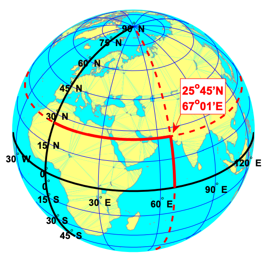
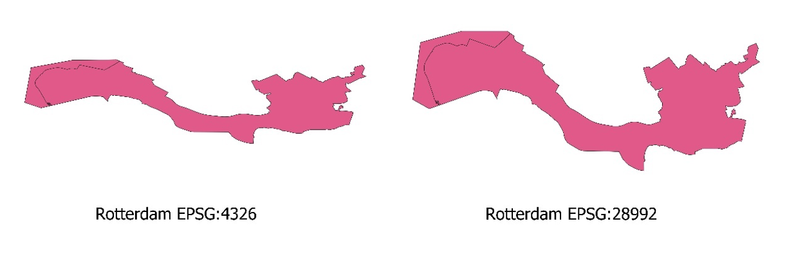
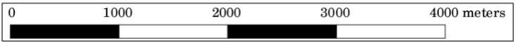

::: questions

-   How do I describe the location of a geographic feature on the surface of the earth?
-   What is coordinate reference system (CRS) and how do I describe different types of CRS?
-   How do I decide on what CRS to use?  

:::

::: objectives

-   Identify the CRS that is best fit for a specific research question.

:::

## The shape of the Earth

The shape of the Earth is approximately a sphere which is slightly wider than it is tall, and which is called **ellipsoid**. The true shape of the Earth is an irregular ellipsoid, the so-called **geoid**, as illustrated in the image below.

The shape of the Earth. Source: United Nations Statistics Division and International Cartographic Association (2012a).

The most common and basic representation of the position of points on the Earth is the combination of the **geographical latitude and longitude**, as shown below.

Geographical latitude and longitude. Source: van der Marel (2014).

**Meridians** are **vertical** circles with constant longitude, called **__great circles__**, which run from the North Pole to the South Pole. **Parallels** are **horizontal** circles with constant latitude, which are called **__small circles__**. Only the equator (the largest parallel) is also a great circle.

The black lines in the figure above show the equator and the prime meridian running through Greenwich, with latitude and longitude labels. The red dotted lines show the meridian and parallel running through Karachi, Pakistan (25°45’N, 67°01’E).

## Map projection

**Map projection** is a systematic transformation of the latitudes and longitudes of locations on the surface of an ellipsoid into locations on a plane. It is a transformation of the three-dimensional Earth’s surface into its two-dimensional representation on a sheet of paper or computer screen (see the image below for a comparison with flattening an orange peel).

Map projection represented as flattening an orange peel. Source: Data Carpentry (2023).

Many different map projections are in use for different purposes. Generally, they can be categorised into the following groups: cylindrical, conic, and azimuthal (see @fig-projections).

Cylindrical, conic, and azimuthal map projections. Source: Knippers (2009).

Each map projection introduces a **distortion** in geometrical elements – **distance**, **angle**, and **area**. Depending on which of these geometrical elements are more relevant for a specific map, we can choose an appropriate map projection. **Conformal projections** are the best for preserving angles between any two curves; **equal area (equivalent) projections** preserve the area or scale; **equal distance (conventional) projections** are the best for preserving distances.

## Coordinate reference systems (CRS)

A **coordinate reference system (CRS)** is a coordinate-based local, regional or global system for locating geographical entities, which uses a specific map projection. It defines how the two-dimensional, projected map relates to real places on the Earth.

All coordinate reference systems are included in a public registry called the **EPSG Geodetic Parameter Dataset (EPSG registry)**, initiated in 1985 by a member of the European Petroleum Survey Group (EPSG). Each CRS has a unique **EPSG code**, which makes it possible to easily identify them among the large number of CRS. This is particularly important for transforming spatial data from one CRS to another.

Some of the most commonly used CRS in the Netherlands are the following:

-   **World Geodetic System 1984 (WGS84)** is the best known global reference system (EPSG:4326).
-   **European Terrestrial Reference System 1989 (ETRS89)** is the standard coordinate system for Europe (EPSG:4258).
-   The most popular projected CRS in the Netherlands is ‘Stelsel van de Rijksdriehoeksmeting (RD)’ registered in EPSG as **Amersfoort / RD New (EPSG:28992)**.

The main parameters of each CRS are the following:

-   **Datum** is a model of the shape of the Earth, which specifies how a coordinate system is linked to the Earth, e.g. how to define the origin of the coordinate axis – where (0,0) is. It has angular units (degrees).
-   **Projection** is mathematical transformation of the angular measurements on the Earth to linear units (e.g. meters) on a flat surface (paper or a computer screen).
-   **Additional parameters**, such as a definition of the centre of the map, are often necessary to create the full CRS.

In this workshop, we use the following two CRS:

|                | WGS 84 (EPSG:4326)                                       | Amersfoort / RD New (EPSG:28992)                |
|-----------------|----------------------------|----------------------------|
| Definition | Dynamic (relies on a datum which is not plate-fixed) | Static (relies on a datum which is plate-fixed)         |
| Celestial body | Earth | Earth |
| Ellipsoid | WGS-84 | Bessel 1841 |
| Prime meridian | International Reference Meridian | Greenwich |
| Datum          | World Geodetic System 1984 ensemble                      | Amersfoort                                      |
| Projection     | Geographic (uses latitude and longitude for coordinates) | Projected (uses meters for coordinates)         |
| Method         | Lat/long (Geodetic alias)                                | Oblique Stereographic Alternative               |
| Units          | Degrees                                                  | Meters                                          |

: Main properties of WGS 84 and Amersfoort / RD New coordinate reference systems

The figure below shows the same city (Rotterdam) in these two CRS.
    

Rotterdam in two different CRS

In addition to using different CRS, these two maps of Rotterdam also have different scales. 

## Map scale

**Map scale** measures the ratio between distance on a map and the corresponding distance on the ground. For example, on a 1:100 000 scale map, 1cm on the map equals 1km (100 000 cm) on the ground. Map scale can be expressed in the following three ways:

|||
|---|----------| 
|Verbal: | 1 centimetre represents 250 meters |
|Fraction: | 1:25000 |
|Graphic: | {width=75%} |

::: challenge

# Challenge: CRS for calculating areas

You want to investigate which European country has the largest urban area. Which CRS will you use?

a.	EPSG:4326
b.	EPSG:28992
c.	EPSG:3035

Hint: Go to https://epsg.io/ or https://epsg.org/search/by-name and check properties of the given CRS, such as datum, type of map projection, units of measure etc. 

::: solution

Correct answer: c. EPSG:3035

:::

:::

::: challenge

# Challenge: CRS for calculating shortest paths

You want to calculate the shortest path between two buildings in Delft. Which CRS will you use?  

a.	EPSG:4326
b.	EPSG:28992
c.	EPSG:3035  

Hint: Go to https://epsg.io/ or https://epsg.org/search/by-name and check properties of the given CRS, such as datum, type of map projection, units of measure etc. 

::: solution

Correct answer: b. EPSG:28992

:::

:::

## References

- Knippers, R. (2009): Geometric aspects of mapping. International Institute for Geo-Information Science and Earth Observation (ITC), Enschede. https://kartoweb.itc.nl/geometrics/ (Accessed 22-01-2024)

- United Nations Statistics Division and International Cartographic Association (2012): 3. Plane rectangular coordinate systems – A) The ellipsoid / geoid. https://unstats.un.org/unsd/geoinfo/ungegn/docs/_data_icacourses/_HtmlModules/_Selfstudy/S06/S06_03a.html (Accessed 22-01-2024)

- Van der Marel, H. (2014). Reference systems for surveying and mapping. Lecture notes. Faculty of Civil Engineering and Geosciences, Delft University of Technology, Delft, The Netherlands. https://gnss1.tudelft.nl/pub/vdmarel/reader/CTB3310_RefSystems_1-2a_print.pdf (Accessed 22-01-2024)

::: callout
# Useful resources

-   Campbell, J., Shin, M. E. (2011). Essentials of Geographic Information Systems. Textbooks. 2. <https://digitalcommons.liberty.edu/textbooks/2> (Accessed 22-01-2024)

-   Data Carpentry (2023): Introduction to Geospatial Concepts. Coordinate Reference Systems. <https://datacarpentry.org/organization-geospatial/03-crs.html> (Accessed 22-01-2024)

-   GeoRepository (2024): EPSG Geodetic Parameter Dataset <https://epsg.org/home.html> (Accessed 22-01-2024)

-   Klokan Technologies GmbH (2022) <https://epsg.io/> (Accessed 22-01-2024)

-   United Nations Statistics Division and International Cartographic Association (2012b): UNGEGN-ICA webcourse on Toponymy. <https://unstats.un.org/unsd/geoinfo/ungegn/docs/_data_icacourses/2012_Home.html> (Accessed 22-01-2024)
:::

::: keypoints

-   Each location on the Earth has its geographical latitude and longitude, which can be transformed on a plane using a map projection.

-   Depending on the research question, we need a global, regional, or local CRS suitable properties.

 
:::
