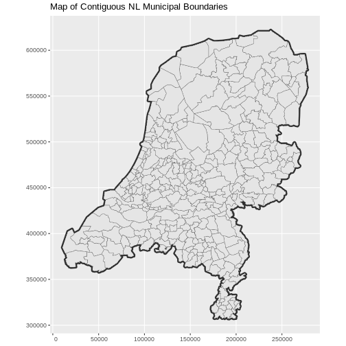
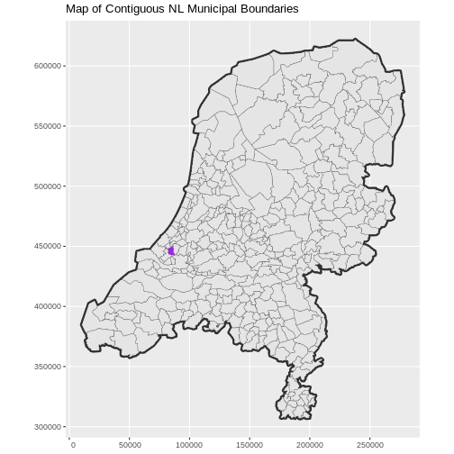
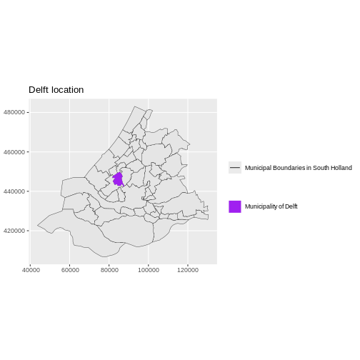

:::::::::::::::::::::::::::::::::::::: questions 

- What do I do when vector data do not line up?

::::::::::::::::::::::::::::::::::::::::::::::::

::::::::::::::::::::::::::::::::::::: objectives


After completing this episode, participants should be able to…

- Plot vector objects with different CRSs in the same plot.

::::::::::::::::::::::::::::::::::::::::::::::::

## Working with spatial data from different sources

In this episode, we will work with a different dataset containing Dutch municipal 
boundaries. We start by reading the data and plotting it.


``` r
municipal_boundary_NL <- st_read("data/nl-gemeenten.shp")
```

``` output
Reading layer `nl-gemeenten' from data source 
  `/home/runner/work/r-geospatial-urban/r-geospatial-urban/site/built/data/nl-gemeenten.shp' 
  using driver `ESRI Shapefile'
Simple feature collection with 344 features and 6 fields
Geometry type: MULTIPOLYGON
Dimension:     XY
Bounding box:  xmin: 10425.16 ymin: 306846.2 xmax: 278026.1 ymax: 621876.3
Projected CRS: Amersfoort / RD New
```


``` r
ggplot() +
  geom_sf(data = municipal_boundary_NL) +
  labs(title = "Map of Contiguous NL Municipal Boundaries") +
  coord_sf(datum = st_crs(28992))
```


We can add a country boundary layer to make it look nicer. If we specify a thicker line width using size = 2 for the country boundary layer, it will make our map pop! We read the country boundary from a different file.


``` r
country_boundary_NL <- st_read("data/nl-boundary.shp")
```

``` output
Reading layer `nl-boundary' from data source 
  `/home/runner/work/r-geospatial-urban/r-geospatial-urban/site/built/data/nl-boundary.shp' 
  using driver `ESRI Shapefile'
Simple feature collection with 1 feature and 1 field
Geometry type: MULTIPOLYGON
Dimension:     XY
Bounding box:  xmin: 10425.16 ymin: 306846.2 xmax: 278026.1 ymax: 621876.3
Projected CRS: Amersfoort / RD New
```


``` r
ggplot() +
  geom_sf(
    data = country_boundary_NL,
    color = "gray18",
    linewidth = 2
  ) +
  geom_sf(
    data = municipal_boundary_NL,
    color = "gray40"
  ) +
  labs(title = "Map of Contiguous NL Municipal Boundaries") +
  coord_sf(datum = st_crs(28992))
```



We confirm that the CRS of both boundaries is 28992.


``` r
st_crs(municipal_boundary_NL)$epsg
```

``` output
[1] 28992
```


``` r
st_crs(country_boundary_NL)$epsg
```

``` output
[1] 28992
```

We read the municipal boundary of Delft and make sure that it is in the same CRS
as the country-level municipal boundaries and country boundary layers.


``` r
boundary_Delft <- st_read("data/delft-boundary.shp")
```

``` output
Reading layer `delft-boundary' from data source 
  `/home/runner/work/r-geospatial-urban/r-geospatial-urban/site/built/data/delft-boundary.shp' 
  using driver `ESRI Shapefile'
Simple feature collection with 1 feature and 1 field
Geometry type: POLYGON
Dimension:     XY
Bounding box:  xmin: 4.320218 ymin: 51.96632 xmax: 4.407911 ymax: 52.0326
Geodetic CRS:  WGS 84
```

``` r
st_crs(boundary_Delft)$epsg
```

``` output
[1] 4326
```

``` r
boundary_Delft <- st_transform(boundary_Delft, 28992)
```


``` r
ggplot() +
  geom_sf(
    data = country_boundary_NL,
    linewidth = 2,
    color = "gray18"
  ) +
  geom_sf(
    data = municipal_boundary_NL,
    color = "gray40"
  ) +
  geom_sf(
    data = boundary_Delft,
    color = "purple",
    fill = "purple"
  ) +
  labs(title = "Map of Contiguous NL Municipal Boundaries") +
  coord_sf(datum = st_crs(28992))
```



::: challenge

# Challenge: Plot multiple layers of spatial data
<!-- 5 minutes -->

Create a map of South Holland as follows:

1. Import `nl-gemeenten.shp` and filter only the municipalities in South Holland.
2. Plot it and adjust line width as necessary.
3. Layer the boundary of Delft onto the plot.
4. Add a title.
5. Add a legend that shows both the municipal boundaries (as a line) and the boundary of Delft (as a filled polygon).

::: solution


``` r
boundary_ZH <- municipal_boundary_NL |>
  filter(ligtInPr_1 == "Zuid-Holland")
```


``` r
ggplot() +
  geom_sf(
    data = boundary_ZH,
    aes(color = "color"),
    show.legend = "line"
  ) +
  scale_color_manual(
    name = "",
    labels = "Municipal Boundaries in South Holland",
    values = c("color" = "gray18")
  ) +
  geom_sf(
    data = boundary_Delft,
    aes(shape = "shape"),
    color = "purple",
    fill = "purple"
  ) +
  scale_shape_manual(
    name = "",
    labels = "Municipality of Delft",
    values = c("shape" = 19)
  ) +
  labs(title = "Delft location") +
  theme(legend.background = element_rect(color = NA)) +
  coord_sf(datum = st_crs(28992))
```



:::

:::

::: callout

# Projecting layers

Note that `ggplot2` may reproject the layers on the fly for visualisation purposes, but for geoprocessing purposes, you still need to reproject the layers explicitly with `st_transform()`. This will become clear in a [later episode](../episodes/16-basic-gis-with-r-sf.Rmd) when we perform GIS operations.

:::

## Export a shapefile

To save a file, use the `st_write()` function from the `sf` package. Although `sf` guesses the driver needed for a specified output file name from its extension, this can be made explicitly via the `driver` argument. In our case `driver = "ESRI Shapefile"` ensures that the output is correctly saved as a `.shp` file.


``` r
st_write(leisure_locations_selection,
  "data/leisure_locations_selection.shp",
  driver = "ESRI Shapefile"
)
```

::::::::::::::::::::::::::::::::::::: keypoints 

- `ggplot2` automatically converts all objects in a plot to the same CRS.
- For geoprocessing purposes, you still need to reproject the layers you use to the same CRS.
- You can export an `sf` object to a shapefile with `st_write()`.

::::::::::::::::::::::::::::::::::::::::::::::::

