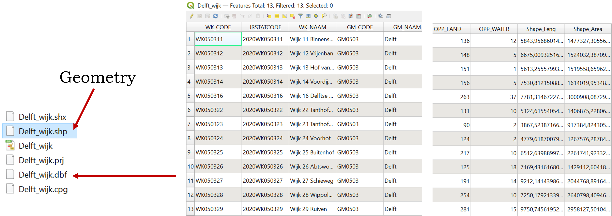
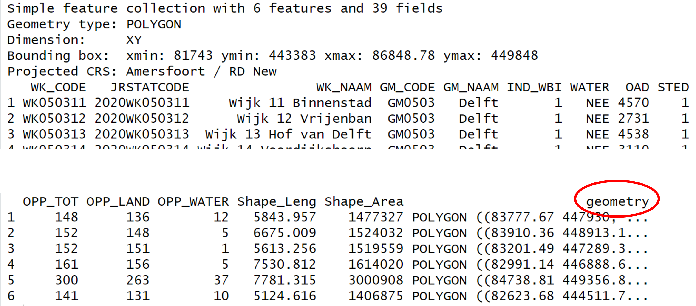
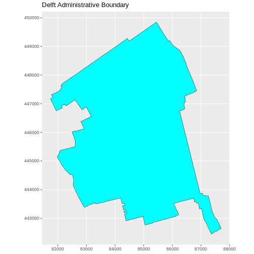

:::::::::::::::::::::::::::::::::::::: questions 

- How can I read, examine and visualize point, line and polygon vector data in R?

::::::::::::::::::::::::::::::::::::::::::::::::

::::::::::::::::::::::::::::::::::::: objectives

After completing this episode, participants should be able to…

- Differentiate between point, line, and polygon vector data.
- Load vector data into R.
- Access the attributes of a vector object in R.

::::::::::::::::::::::::::::::::::::::::::::::::

:::::::::::::::::::::::::::::::::::::::::::::::::::::::::::::::::::: instructor

Make sure that the `sf` package and its dependencies are installed before the 
workshop. The installation can be lengthy, so allocate enough extra time 
before the workshop for solving installation problems. We recommend one
or two installation 'walk-in' hours on a day before the workshop. Also, 15-30 
minutes at the beginning of the first workshop day should be enough to tackle 
last-minute installation issues.

::::::::::::::::::::::::::::::::::::::::::::::::::::::::::::::::::::::::::::::::

::: prereq

In this lesson you will work with the `sf` package. Note that the `sf` package has some external dependencies, namely GEOS, PROJ.4, GDAL and UDUNITS, which need to be installed beforehand. Before starting the lesson, follow the workshop [setup instructions](../learners/setup.md) for the installation of `sf` and its dependencies.

:::

First we need to load the packages we will use in this lesson. We will use the `tidyverse` package with which you are already familiar from the previous lesson. In addition, we need to load the [`sf`](https://r-spatial.github.io/sf/) package for working with spatial vector data. 


``` r
library(tidyverse) # wrangle, reshape and visualize data
library(sf) # work with spatial vector data
```

::: callout

# The 'sf' package  

`sf` stands for Simple Features which is a standard defined by the Open Geospatial Consortium for storing and accessing geospatial vector data. Read more about simple features and its implementation in R [here](https://r-spatial.github.io/sf/articles/sf1.html).

:::

::: callout

# Geometry in QGIS and in R

You may be familiar with GIS software using graphical interfaces like QGIS. In QGIS, you do not see the geometry in the Attribute Table but it is directly displayed in the map view. In R, however, the geometry is stored in a column called `geometry`.





:::

## Import shapefiles

Let's start by opening a shapefile. Shapefiles are a common file format to store spatial vector data used in GIS software. Note that a shapefile consists of multiple files and it is important to keep them all together in the same location. We will read a shapefile with the administrative boundary of Delft with the function `st_read()` from the `sf` package. 


``` r
boundary_Delft <- st_read("data/delft-boundary.shp", quiet = TRUE)
```

::: callout

# All 'sf' functions start with 'st_'

Note that all functions from the `sf` package start with the standard prefix `st_` which stands for Spatial Type. This is helpful in at least two ways:  

1. it allows for easy autocompletion of function names in RStudio, and
2. it makes the interaction with or translation to/from software using the simple features standard like PostGIS easy.

:::

::: callout

# Shapefiles vs. GeoPackage

Shapefiles are increasingly being replaced by more modern formats like GeoPackage. An advantage of GeoPackage is that it is a single file that can store multiple layers and attributes, whereas shapefiles consist of multiple files. However, shapefiles are still widely used and are a good starting point for learning about spatial data.

:::

## Spatial Metadata

By default (with `quiet = FALSE`), the `st_read()` function provides a message with a summary of metadata about the file that was read in.


``` r
st_read("data/delft-boundary.shp")
```

``` output
Reading layer `delft-boundary' from data source 
  `/home/runner/work/r-geospatial-urban/r-geospatial-urban/site/built/data/delft-boundary.shp' 
  using driver `ESRI Shapefile'
Simple feature collection with 1 feature and 1 field
Geometry type: POLYGON
Dimension:     XY
Bounding box:  xmin: 4.320218 ymin: 51.96632 xmax: 4.407911 ymax: 52.0326
Geodetic CRS:  WGS 84
```

To examine the metadata in more detail, we can use other, more specialised, functions from the `sf` package. The `st_geometry_type()` function, for instance, gives us information about the geometry type, which in this case is `POLYGON`.


``` r
st_geometry_type(boundary_Delft)
```

``` output
[1] POLYGON
18 Levels: GEOMETRY POINT LINESTRING POLYGON MULTIPOINT ... TRIANGLE
```

::: callout

# Geometry types

The `sf` package supports the following common geometry types: `POINT`, `LINESTRING`, `POLYGON`, `MULTIPOINT`, `MULTILINESTRING`, `MULTIPOLYGON`, `GEOMETRYCOLLECTION`. More information about support for these and other geometry types can be found in the [sf package documentation](https://r-spatial.github.io/sf/articles/sf1.html).

:::

The `st_crs()` function returns the coordinate reference system (CRS) used by the shapefile, which in this case is `WGS 84` and has the unique reference code `EPSG: 4326`. 


``` r
st_crs(boundary_Delft)
```

``` output
Coordinate Reference System:
  User input: WGS 84 
  wkt:
GEOGCRS["WGS 84",
    DATUM["World Geodetic System 1984",
        ELLIPSOID["WGS 84",6378137,298.257223563,
            LENGTHUNIT["metre",1]]],
    PRIMEM["Greenwich",0,
        ANGLEUNIT["degree",0.0174532925199433]],
    CS[ellipsoidal,2],
        AXIS["latitude",north,
            ORDER[1],
            ANGLEUNIT["degree",0.0174532925199433]],
        AXIS["longitude",east,
            ORDER[2],
            ANGLEUNIT["degree",0.0174532925199433]],
    ID["EPSG",4326]]
```

::: callout

# Examining the output of 'st_crs()'

As the output of `st_crs()` can be long, you can use `$Name` and `$epsg` after the `crs()` call to extract the projection name and EPSG code respectively. 


``` r
st_crs(boundary_Delft)$Name
```

``` output
[1] "WGS 84"
```

``` r
st_crs(boundary_Delft)$epsg
```

``` output
[1] 4326
```

The `$` operator is used to extract a specific part of an object. We used it in a [previous episode](../episodes/03-explore-data.Rmd) to subset a data frame by column name. In this case, it is used to extract named elements stored in a `crs` object. For more information, see [the documentation of the `st_crs` function](https://r-spatial.github.io/sf/reference/st_crs.html#details).

:::

The `st_bbox()` function shows the extent of the layer.  


``` r
st_bbox(boundary_Delft)
```

``` output
     xmin      ymin      xmax      ymax 
 4.320218 51.966316  4.407911 52.032599 
```

As `WGS 84` is a **geographic CRS**, the extent of the shapefile is displayed in degrees. We need a **projected CRS**, which in the case of the Netherlands is the `Amersfoort / RD New` projection. To reproject our shapefile, we will use the `st_transform()` function. For the `crs` argument we can use the EPSG code of the CRS we want to use, which is `28992` for the `Amersfort / RD New` projection. 
To check the EPSG code of any CRS, we can check this website: https://epsg.io/


``` r
boundary_Delft <- st_transform(boundary_Delft, crs = 28992)
st_crs(boundary_Delft)$Name
```

``` output
[1] "Amersfoort / RD New"
```

``` r
st_crs(boundary_Delft)$epsg
```

``` output
[1] 28992
```

Notice that the bounding box is measured in meters after the transformation. The `$units_gdal` named element confirms that the new CRS uses metric units.


``` r
st_bbox(boundary_Delft)
```

``` output
     xmin      ymin      xmax      ymax 
 81743.00 442446.21  87703.78 449847.95 
```

``` r
st_crs(boundary_Delft)$units_gdal
```

``` output
[1] "metre"
```

We confirm the transformation by examining the reprojected shapefile.


``` r
boundary_Delft
```

``` output
Simple feature collection with 1 feature and 1 field
Geometry type: POLYGON
Dimension:     XY
Bounding box:  xmin: 81743 ymin: 442446.2 xmax: 87703.78 ymax: 449848
Projected CRS: Amersfoort / RD New
  osm_id                       geometry
1 324269 POLYGON ((87703.78 442651, ...
```

::: callout

# More about CRS

Read more about Coordinate Reference Systems [in the previous episode](../episodes/08-intro-to-geospatial-concepts.Rmd). We will also practice transformation between CRS in [Handling Spatial Projection & CRS](../episodes/12-handling-spatial-projection-and-crs.Rmd).

:::


## Plot a vector layer

Now, let's plot this shapefile. You are already familiar with the `ggplot2` package from [Introduction to Visualisation](../episodes/04-intro-to-visualisation.Rmd). `ggplot2` has special `geom_` functions for spatial data. We will use the `geom_sf()` function for `sf` data. We use `coord_sf()` to ensure that the coordinates shown on the two axes are displayed in meters.


``` r
ggplot(data = boundary_Delft) +
  geom_sf(size = 3, color = "black", fill = "cyan1") +
  labs(title = "Delft Administrative Boundary") +
  coord_sf(datum = st_crs(28992)) # displays the axes in meters
```



::::::::::::::::::::::::::::::::::::: challenge 

### Challenge: Import line and point vector layers

Read in `delft-streets.shp` and `delft-leisure.shp` and assign them to `lines_Delft` and `points_Delft` respectively. Answer the following questions:

1. What is the CRS and extent for each object?
2. Do the files contain points, lines, or polygons?
3. How many features are in each file?

:::::::::::::::::::::::: solution 


``` r
lines_Delft <- st_read("data/delft-streets.shp")
points_Delft <- st_read("data/delft-leisure.shp")
```

We can check the type of type of geometry with the `st_geometry_type()` function. `lines_Delft` contains `"LINESTRING"` geometry and `points_Delft` is made of `"POINT"` geometries. 


``` r
st_geometry_type(lines_Delft)[1]
```

``` output
[1] LINESTRING
18 Levels: GEOMETRY POINT LINESTRING POLYGON MULTIPOINT ... TRIANGLE
```

``` r
st_geometry_type(points_Delft)[2]
```

``` output
[1] POINT
18 Levels: GEOMETRY POINT LINESTRING POLYGON MULTIPOINT ... TRIANGLE
```

Both `lines_Delft` and `points_Delft` are in `EPSG:28992`.


``` r
st_crs(lines_Delft)$epsg
```

``` output
[1] 28992
```

``` r
st_crs(points_Delft)$epsg
```

``` output
[1] 28992
```

When looking at the bounding boxes with the `st_bbox()` function, we see the spatial extent of the two objects in a projected CRS using meters as units. `lines_Delft()` and `points_Delft` have similar extents.


``` r
st_bbox(lines_Delft)
```

``` output
     xmin      ymin      xmax      ymax 
 81759.58 441223.13  89081.41 449845.81 
```

``` r
st_bbox(points_Delft)
```

``` output
     xmin      ymin      xmax      ymax 
 81863.21 442621.15  87370.15 449345.08 
```

:::::::::::::::::::::::::::::::::

::::::::::::::::::::::::::::::::::::::::::::::::


::::::::::::::::::::::::::::::::::::: keypoints 

- Metadata for vector layers include geometry type, CRS, and extent and can be examined with the `sf` functions `st_geometry_type()`, `st_crs()`, and `st_bbox()`, respectively.
- Load spatial objects into R with the `sf` function `st_read()`.
- Spatial objects can be plotted directly with `ggplot2` using the `geom_sf()` function. No need to convert to a data frame.

::::::::::::::::::::::::::::::::::::::::::::::::
