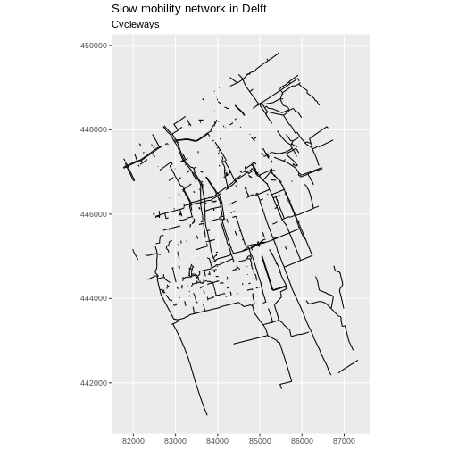
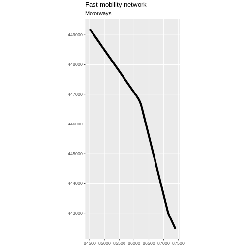
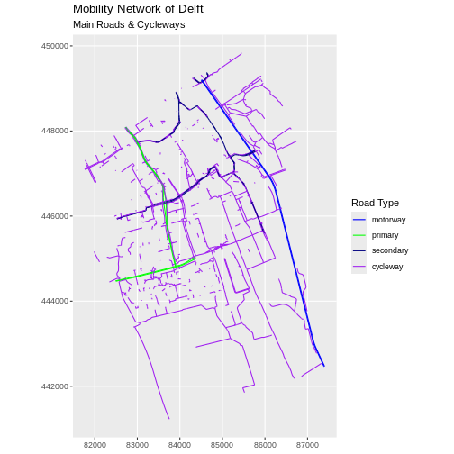
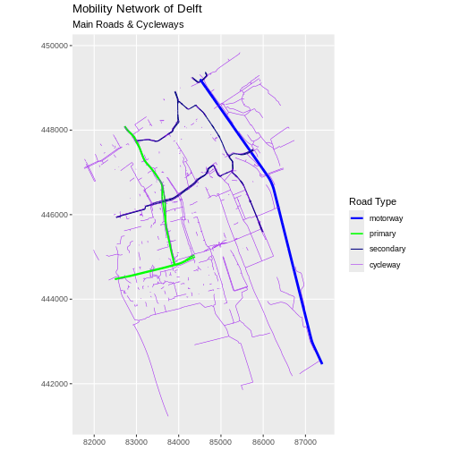
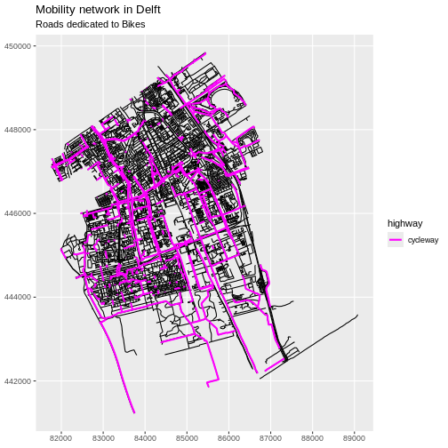

:::::::::::::::::::::::::::::::::::::: questions 

- How can I examine the attributes of a vector layer?

::::::::::::::::::::::::::::::::::::::::::::::::

::::::::::::::::::::::::::::::::::::: objectives

After completing this episode, participants should be able to…

- Query attributes of a vector object.

- Subset vector objects using specific attribute values.

- Plot a vector feature, coloured by unique attribute values.

::::::::::::::::::::::::::::::::::::::::::::::::

# Query Vector Feature Metadata

Let's have a look at the content of the loaded data, starting with `lines_Delft`. In essence, an `"sf"` object is a data.frame with a "sticky" geometry column and some extra metadata, like the CRS, extent and geometry type we examined earlier.


``` r
lines_Delft
```

``` output
Simple feature collection with 11244 features and 2 fields
Geometry type: LINESTRING
Dimension:     XY
Bounding box:  xmin: 81759.58 ymin: 441223.1 xmax: 89081.41 ymax: 449845.8
Projected CRS: Amersfoort / RD New
First 10 features:
    osm_id  highway                       geometry
1  4239535 cycleway LINESTRING (86399.68 448599...
2  4239536 cycleway LINESTRING (85493.66 448740...
3  4239537 cycleway LINESTRING (85493.66 448740...
4  4239620  footway LINESTRING (86299.01 448536...
5  4239621  footway LINESTRING (86307.35 448738...
6  4239674  footway LINESTRING (86299.01 448536...
7  4310407  service LINESTRING (84049.47 447778...
8  4310808    steps LINESTRING (84588.83 447828...
9  4348553  footway LINESTRING (84527.26 447861...
10 4348575  footway LINESTRING (84500.15 447255...
```

This means that we can examine and manipulate them as data frames. For instance, we can look at the number of variables (columns in a data frame) with `ncol()`.


``` r
ncol(lines_Delft)
```

``` output
[1] 3
```

In the case of `point_Delft` those columns are `"osm_id"`, `"highway"` and `"geometry"`. We can check the names of the columns with the function `names()`.


``` r
names(lines_Delft)
```

``` output
[1] "osm_id"   "highway"  "geometry"
```

::: callout

# The geometry as a column

Note that in R the geometry is just another column and counts towards the number
returned by `ncol()`. This is different from GIS software with graphical user 
interfaces, where the geometry is displayed in a viewport not as a column in the 
attribute table.

:::

We can also preview the content of the object by looking at the first 6 rows with the `head()` function, which in the case of an `sf` object is similar to examining the object directly.


``` r
head(lines_Delft)
```

``` output
Simple feature collection with 6 features and 2 fields
Geometry type: LINESTRING
Dimension:     XY
Bounding box:  xmin: 85107.1 ymin: 448400.3 xmax: 86399.68 ymax: 449076.2
Projected CRS: Amersfoort / RD New
   osm_id  highway                       geometry
1 4239535 cycleway LINESTRING (86399.68 448599...
2 4239536 cycleway LINESTRING (85493.66 448740...
3 4239537 cycleway LINESTRING (85493.66 448740...
4 4239620  footway LINESTRING (86299.01 448536...
5 4239621  footway LINESTRING (86307.35 448738...
6 4239674  footway LINESTRING (86299.01 448536...
```


## Explore values within one attribute

Using the `$` operator, we can examine the content of a single field of our lines object. Let's have a look at the `highway` field, a categorical variable stored in the `lines_Delft` object as `character`. To avoid displaying all 11244 values of `highway`, we will preview it with the `head()` function:


``` r
head(lines_Delft$highway, 10)
```

``` output
 [1] "cycleway" "cycleway" "cycleway" "footway"  "footway"  "footway" 
 [7] "service"  "steps"    "footway"  "footway" 
```

The first rows returned by the `head()` function do not necessarily contain all unique values within the `highway` field. To see all unique values, we can use the `unique()` function. This function extracts all possible values of a character variable. For the `highway` field, this returns all types of roads stored in `lines_Delft`.


``` r
unique(lines_Delft$highway)
```

``` output
 [1] "cycleway"       "footway"        "service"        "steps"         
 [5] "residential"    "unclassified"   "construction"   "secondary"     
 [9] "busway"         "living_street"  "motorway_link"  "tertiary"      
[13] "track"          "motorway"       "path"           "pedestrian"    
[17] "primary"        "bridleway"      "trunk"          "tertiary_link" 
[21] "services"       "secondary_link" "trunk_link"     "primary_link"  
[25] "platform"       "proposed"       NA              
```

:::::::::::::::::::::::: callout 

# Using factors in sf objects

R is also able to handle categorical variables called factors, introduced in [an earlier episode](../episodes/02-data-structures.Rmd). With factors, we can use the `levels()` function to show unique values. To examine unique values of the `highway` variable this way, we have to first transform it into a factor with the `factor()` function:


``` r
factor(lines_Delft$highway) |> levels()
```

``` output
 [1] "bridleway"      "busway"         "construction"   "cycleway"      
 [5] "footway"        "living_street"  "motorway"       "motorway_link" 
 [9] "path"           "pedestrian"     "platform"       "primary"       
[13] "primary_link"   "proposed"       "residential"    "secondary"     
[17] "secondary_link" "service"        "services"       "steps"         
[21] "tertiary"       "tertiary_link"  "track"          "trunk"         
[25] "trunk_link"     "unclassified"  
```
Note that this way the values are shown by default in alphabetical order and `NA`s are not displayed, whereas using `unique()` returns unique values in the order of their occurrence in the data frame and it also shows `NA` values.

::::::::::::::::::::::::::::::::

::::::::::::::::::::::::::::::::::::: challenge 

## Challenge: Attributes for different spatial classes
<!-- 3 minutes -->

Explore the attributes associated with the `point_Delft` spatial object.

1. How many fields does it have?
2. What types of leisure points do the points represent? Give three examples.
3. Which of the following is NOT a field of the `point_Delft` object?

  A) `location` B) `leisure` C) `osm_id`

:::::::::::::::::::::::: solution 

1. To find the number of fields, we use the `ncol()` function:


``` r
ncol(point_Delft)
```

``` output
[1] 3
```

2. The types of leisure point are in the column named `leisure`.

Using the `head()` function which displays 6 rows by default, we only see two values and `NA`s. 


``` r
head(point_Delft)
```

``` output
Simple feature collection with 6 features and 2 fields
Geometry type: POINT
Dimension:     XY
Bounding box:  xmin: 83839.59 ymin: 443827.4 xmax: 84967.67 ymax: 447475.5
Projected CRS: Amersfoort / RD New
     osm_id      leisure                  geometry
1 472312297 picnic_table POINT (84144.72 443827.4)
2 480470725       marina POINT (84967.67 446120.1)
3 484697679         <NA> POINT (83912.28 447431.8)
4 484697682         <NA> POINT (83895.43 447420.4)
5 484697691         <NA>   POINT (83839.59 447455)
6 484697814         <NA> POINT (83892.53 447475.5)
```

We can increase the number of rows with the `n` argument (e.g., `head(n = 10)` to show 10 rows) until we see at least three distinct values in the leisure column. Note that printing an `sf` object will also display the first 10 rows.


``` r
# you might be lucky to see three distinct values
head(point_Delft, 10)
```

``` output
Simple feature collection with 10 features and 2 fields
Geometry type: POINT
Dimension:     XY
Bounding box:  xmin: 82485.72 ymin: 443827.4 xmax: 85385.25 ymax: 448341.3
Projected CRS: Amersfoort / RD New
       osm_id       leisure                  geometry
1   472312297  picnic_table POINT (84144.72 443827.4)
2   480470725        marina POINT (84967.67 446120.1)
3   484697679          <NA> POINT (83912.28 447431.8)
4   484697682          <NA> POINT (83895.43 447420.4)
5   484697691          <NA>   POINT (83839.59 447455)
6   484697814          <NA> POINT (83892.53 447475.5)
7   549139430        marina POINT (84479.99 446823.5)
8   603300994 sports_centre POINT (82485.72 445237.5)
9   883518959 sports_centre POINT (85385.25 448341.3)
10 1148515039    playground    POINT (84661.3 446818)
```

We have our answer (`sports_centre` is the third value), but in general this is not a good approach as the first rows might still have many `NA`s and three distinct values might still not be present in the first `n` rows of the data frame. To remove `NA`s, we can use the function `na.omit()` on the leisure column to remove `NA`s completely. Note that we use the `$` operator to examine the content of a single variable.


``` r
# this is better
na.omit(point_Delft$leisure) |> head()
```

``` output
[1] "picnic_table"  "marina"        "marina"        "sports_centre"
[5] "sports_centre" "playground"   
```

To show only unique values, we can use the `levels()` function on a factor to only see the first occurrence of each distinct value. Note `NA`s are dropped in this case and that we get the first three of the unique alphabetically ordered values.


``` r
# this is even better
factor(point_Delft$leisure) |>
  levels() |>
  head(n = 3)
```

``` output
[1] "dance"       "dog_park"    "escape_game"
```

3. To see a list of all fields names and answer the last question, we can use the `names()` function.


``` r
names(point_Delft)
```

``` output
[1] "osm_id"   "leisure"  "geometry"
```

A) `location` is not a field of the `point_Delft` object. 

:::::::::::::::::::::::::::::::::

::::::::::::::::::::::::::::::::::::::::::::::::


## Subset features

We can use the `filter()` function to select a subset of features from a spatial object, just like with data frames. Let's select only `cycleways` from our street data. 


``` r
cycleway_Delft <- lines_Delft |>
  filter(highway == "cycleway")
```

Our subsetting operation reduces the number of features from 11244 to 1397.


``` r
nrow(lines_Delft)
```

``` output
[1] 11244
```

``` r
nrow(cycleway_Delft)
```

``` output
[1] 1397
```

This can be useful, for instance, to calculate the total length of cycleways. For that, we first need to calculate the length of each segment with `st_length()`


``` r
cycleway_Delft <- cycleway_Delft |>
  mutate(length = st_length(geometry))

cycleway_Delft |>
  summarise(total_length = sum(length))
```

``` output
Simple feature collection with 1 feature and 1 field
Geometry type: MULTILINESTRING
Dimension:     XY
Bounding box:  xmin: 81759.58 ymin: 441227.3 xmax: 87326.76 ymax: 449834.5
Projected CRS: Amersfoort / RD New
  total_length                       geometry
1 115550.1 [m] MULTILINESTRING ((86399.68 ...
```

Now we can plot only the cycleways.


``` r
ggplot(data = cycleway_Delft) +
  geom_sf() +
  labs(
    title = "Slow mobility network in Delft",
    subtitle = "Cycleways"
  ) +
  coord_sf(datum = st_crs(28992))
```

<div class="figure" style="text-align: center">

<p class="caption">Map of cycleways in Delft.</p>
</div>

::: challenge
<!-- 7 minutes -->

Challenge: Now with motorways

1. Create a new object that only contains the motorways in Delft. 
2. How many features does the new object have?
3. What is the total length of motorways?
4. Plot the motorways.

::: solution

1. To create the new object, we first need to see which value of the `highway` column holds motorways. There is a value called `motorway`.


``` r
unique(lines_Delft$highway)
```

``` output
 [1] "cycleway"       "footway"        "service"        "steps"         
 [5] "residential"    "unclassified"   "construction"   "secondary"     
 [9] "busway"         "living_street"  "motorway_link"  "tertiary"      
[13] "track"          "motorway"       "path"           "pedestrian"    
[17] "primary"        "bridleway"      "trunk"          "tertiary_link" 
[21] "services"       "secondary_link" "trunk_link"     "primary_link"  
[25] "platform"       "proposed"       NA              
```
We extract only the features with the value `motorway`.


``` r
motorway_Delft <- lines_Delft |>
  filter(highway == "motorway")

motorway_Delft
```

``` output
Simple feature collection with 48 features and 2 fields
Geometry type: LINESTRING
Dimension:     XY
Bounding box:  xmin: 84501.66 ymin: 442458.2 xmax: 87401.87 ymax: 449205.9
Projected CRS: Amersfoort / RD New
First 10 features:
      osm_id  highway                       geometry
1    7531946 motorway LINESTRING (87395.68 442480...
2    7531976 motorway LINESTRING (87401.87 442467...
3   46212227 motorway LINESTRING (86103.56 446928...
4  120945066 motorway LINESTRING (85724.87 447473...
5  120945068 motorway LINESTRING (85710.31 447466...
6  126548650 motorway LINESTRING (86984.12 443630...
7  126548651 motorway LINESTRING (86714.75 444772...
8  126548653 motorway LINESTRING (86700.23 444769...
9  126548654 motorway LINESTRING (86716.35 444766...
10 126548655 motorway LINESTRING (84961.78 448566...
```

2. There are 48 features with the value `motorway`.


``` r
nrow(motorway_Delft)
```

``` output
[1] 48
```


3. The total length of motorways is 14877.4361477941.


``` r
motorway_Delft_length <- motorway_Delft |>
  mutate(length = st_length(geometry)) |>
  select(everything(), geometry) |>
  summarise(total_length = sum(length))
```

4. Plot the motorways.


``` r
ggplot(data = motorway_Delft) +
  geom_sf(linewidth = 1.5) +
  labs(
    title = "Fast mobility network",
    subtitle = "Motorways"
  ) +
  coord_sf(datum = st_crs(28992))
```



:::

:::

## Customize plots

Let's say that we want to color different road types with different colors and that we want to determine those colors.


``` r
unique(lines_Delft$highway)
```

``` output
 [1] "cycleway"       "footway"        "service"        "steps"         
 [5] "residential"    "unclassified"   "construction"   "secondary"     
 [9] "busway"         "living_street"  "motorway_link"  "tertiary"      
[13] "track"          "motorway"       "path"           "pedestrian"    
[17] "primary"        "bridleway"      "trunk"          "tertiary_link" 
[21] "services"       "secondary_link" "trunk_link"     "primary_link"  
[25] "platform"       "proposed"       NA              
```

If we look at all the unique values of the highway field of our street network we see more than 20 values. Let's focus on a subset of four values to illustrate the use of distinct colours. We filter the roads that have one of the four given values `"motorway"`, `"primary"`, `"secondary"`, and `"cycleway"`. Note that we do this with the `%in%` operator which is a more compact equivalent of a series of `==` equality conditions joined by the `|` (or) operator. We also make sure that the highway column is a factor column.


``` r
road_types <- c("motorway", "primary", "secondary", "cycleway")

lines_Delft_selection <- lines_Delft |>
  filter(highway %in% road_types) |>
  mutate(highway = factor(highway, levels = road_types))
```

Next we define the four colours we want to use, one for each type of road in our vector object. Note that in R you can use named colours like `"blue"`, `"green"`, `"navy"`, and `"purple"`. If you are using RStudio, you will see the named colours previewed in line. A full list of named colours can be listed with the `colors()` function.


``` r
road_colors <- c("blue", "green", "navy", "purple")
```

We can use the defined colour palette in a ggplot.


``` r
ggplot(data = lines_Delft_selection) +
  geom_sf(aes(color = highway)) +
  scale_color_manual(values = road_colors) +
  labs(
    color = "Road Type",
    title = "Mobility Network of Delft",
    subtitle = "Main Roads & Cycleways"
  ) +
  coord_sf(datum = st_crs(28992))
```



::: challenge

## Challenge: Adjust line width

Follow the same steps to add custom line widths for every road type. 

1. Assign the custom values `1`, `0.75`, `0.5`, `0.25` in this order to an object called `line_widths`. These values will represent line thicknesses that are consistent with the hierarchy of the selected road types.

2. In this case the `linewidth` argument, like the `color` argument above, should be within the `aes()` mapping function and should take the values of the custom line widths.

3. Plot the result, making sure that `linewidth` is named the same way as `color` in the legend.

::: solution


``` r
line_widths <- c(1, 0.75, 0.5, 0.25)
```


``` r
ggplot(data = lines_Delft_selection) +
  geom_sf(aes(color = highway, linewidth = highway)) +
  scale_color_manual(values = road_colors) +
  scale_linewidth_manual(values = line_widths) +
  labs(
    color = "Road Type",
    linewidth = "Road Type",
    title = "Mobility Network of Delft",
    subtitle = "Main Roads & Cycleways"
  ) +
  coord_sf(datum = st_crs(28992))
```


:::

:::

::: challenge

# Challenge: Plot lines by attributes
<!-- 5 minutes -->

Create a plot that emphasizes only roads where bicycles are allowed. To emphasize this, make the lines where bicycles are not allowed THINNER than the roads where bicycles are allowed. Be sure to add a title and legend to your map. You might consider a color palette that has all bike-friendly roads displayed in a bright color. All other lines can be black.

Tip: `geom_sf()` can be called multiple times for multi-layer maps.

::: solution


``` r
class(lines_Delft_selection$highway)
```

``` output
[1] "factor"
```


``` r
levels(factor(lines_Delft$highway))
```

``` output
 [1] "bridleway"      "busway"         "construction"   "cycleway"      
 [5] "footway"        "living_street"  "motorway"       "motorway_link" 
 [9] "path"           "pedestrian"     "platform"       "primary"       
[13] "primary_link"   "proposed"       "residential"    "secondary"     
[17] "secondary_link" "service"        "services"       "steps"         
[21] "tertiary"       "tertiary_link"  "track"          "trunk"         
[25] "trunk_link"     "unclassified"  
```


``` r
# First, create a data frame with only roads where bicycles
# are allowed
lines_Delft_bicycle <- lines_Delft |>
  filter(highway == "cycleway")

# Next, visualise it using ggplot
ggplot(data = lines_Delft) +
  geom_sf() +
  geom_sf(
    data = lines_Delft_bicycle,
    aes(color = highway),
    linewidth = 1
  ) +
  scale_color_manual(values = "magenta") +
  labs(
    title = "Mobility network in Delft",
    subtitle = "Roads dedicated to Bikes"
  ) +
  coord_sf(datum = st_crs(28992))
```



:::

:::

::::::::::::::::::::::::::::::::::::: keypoints 

- Spatial objects in `sf` are similar to standard data frames and can be manipulated using the same functions.

- Almost any feature of a plot can be customized using the various functions and options in the `ggplot2` package.

::::::::::::::::::::::::::::::::::::::::::::::::

