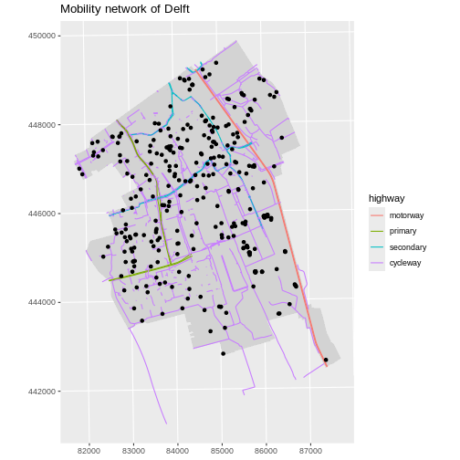
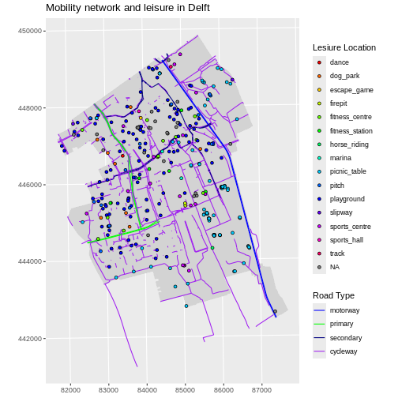
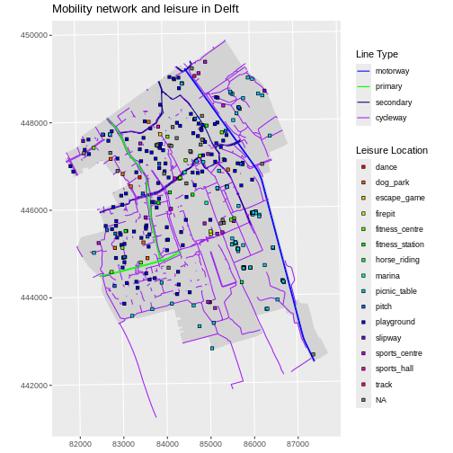
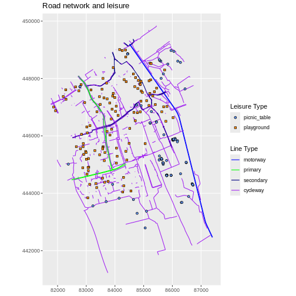

:::::::::::::::::::::::::::::::::::::: questions 

- How can I create map compositions with custom legends using ggplot?

::::::::::::::::::::::::::::::::::::::::::::::::

::::::::::::::::::::::::::::::::::::: objectives

After completing this episode, participants should be able to…

- Plot multiple vector layers in the same plot.
- Apply custom symbols to spatial objects in a plot.

::::::::::::::::::::::::::::::::::::::::::::::::

This episode builds upon the [previous episode](../episodes/10-explore-and-plot-by-vector-layer-attributes.Rmd) to work with vector layers in R and explore how to plot multiple vector layers.


## Load the data

To work with vector data in R, we use the `sf` package. Make sure that it is loaded.

We will continue to work with the three shapefiles that we loaded in the [Open and Plot Vector Layers](../episodes/09-open-and-plot-vector-layers.Rmd) episode.


## Plotting Multiple Vector Layers

So far we learned how to plot information from a single shapefile and do some plot customization. What if we want to create a more complex plot with many shapefiles and unique symbols that need to be represented clearly in a legend?

We will create a plot that combines our leisure locations (`point_Delft`), municipal boundary (`boundary_Delft`) and street (`lines_Delft`) objects. We will also build a custom legend.

To begin, we create a plot with the site boundary as the first layer. Then layer the leisure locations and street data on top in consecutive calls to `geom_sf()`.


``` r
ggplot() +
  geom_sf(
    data = boundary_Delft,
    fill = "lightgrey",
    color = "lightgrey"
  ) +
  geom_sf(
    data = lines_Delft_selection,
    aes(color = highway),
    size = 1
  ) +
  geom_sf(data = point_Delft) +
  labs(title = "Mobility network of Delft") +
  coord_sf(datum = st_crs(28992))
```



Next, let’s build a custom legend using the functions `scale_color_manual()` and `scale_fill_manual()`. We will use the custom `road_colors` object created in the previous episode and we will create a new object called `leisure_colors` to store values of all 15 types of leisure with the `rainbow()` function. 

We also need to customise the shape of the points with the `shape` aesthetic if we want to determine the colours inside the points. `shape = 21` will show the points as circles with a custom fill.


``` r
point_Delft$leisure <- factor(point_Delft$leisure)
levels(point_Delft$leisure) |> length()
```

``` output
[1] 15
```

``` r
leisure_colors <- rainbow(15)

ggplot() +
  geom_sf(
    data = boundary_Delft,
    fill = "lightgrey",
    color = "lightgrey"
  ) +
  geom_sf(
    data = lines_Delft_selection,
    aes(color = highway),
    size = 1
  ) +
  geom_sf(
    data = point_Delft,
    aes(fill = leisure),
    shape = 21
  ) +
  scale_color_manual(
    values = road_colors,
    name = "Road Type"
  ) +
  scale_fill_manual(
    values = leisure_colors,
    name = "Lesiure Location"
  ) +
  labs(title = "Mobility network and leisure in Delft") +
  coord_sf(datum = st_crs(28992))
```



::: challenge

# Challenge: Customizing point shapes

What value of `shape` will display points as squares with custom fills?

::: solution

`shape = 22` will display points as squares with custom fills. Our previous plot would look like this:


``` r
ggplot() +
  geom_sf(
    data = boundary_Delft,
    fill = "lightgrey",
    color = "lightgrey"
  ) +
  geom_sf(
    data = lines_Delft_selection,
    aes(color = highway),
    size = 1
  ) +
  geom_sf(
    data = point_Delft,
    aes(fill = leisure),
    shape = 22
  ) +
  scale_color_manual(
    values = road_colors,
    name = "Line Type"
  ) +
  scale_fill_manual(
    values = leisure_colors,
    name = "Leisure Location"
  ) +
  labs(title = "Mobility network and leisure in Delft") +
  coord_sf(datum = st_crs(28992))
```



:::

:::

We notice that there are quite some playgrounds in the residential parts of Delft, whereas on campus there is a concentration of picnic tables. So that is what our next challenge is about.


::::::::::::::::::::::::::::::::::::: challenge 

## Challenge: Visualising multiple layers with a custom legend

Create a map of leisure locations only including `playground` and `picnic_table`, with each point coloured by the leisure type. Overlay this layer on top of the `lines_Delft` layer (the streets). Tell R to plot playgrounds and picnic tables with different `shape` values. Make sure your plot has a custom legend.

Tip: You can call `scale_` functions multiple times for the same layer, for any of the aesthetics used in `aes()`.

:::::::::::::::::::::::: solution 


``` r
leisure_locations_selection <- st_read("data/delft-leisure.shp") |>
  filter(leisure %in% c("playground", "picnic_table"))
```

``` output
Reading layer `delft-leisure' from data source 
  `/home/runner/work/r-geospatial-urban/r-geospatial-urban/site/built/data/delft-leisure.shp' 
  using driver `ESRI Shapefile'
Simple feature collection with 298 features and 2 fields
Geometry type: POINT
Dimension:     XY
Bounding box:  xmin: 81863.21 ymin: 442621.1 xmax: 87370.15 ymax: 449345.1
Projected CRS: Amersfoort / RD New
```


``` r
factor(leisure_locations_selection$leisure) |> levels()
```

``` output
[1] "picnic_table" "playground"  
```


``` r
blue_orange <- c("cornflowerblue", "darkorange")
```


``` r
ggplot() +
  geom_sf(
    data = lines_Delft_selection,
    aes(color = highway)
  ) +
  geom_sf(
    data = leisure_locations_selection,
    aes(fill = leisure, shape = leisure)
  ) +
  scale_shape_manual(
    name = "Leisure Type",
    values = c(21, 22)
  ) +
  scale_color_manual(
    name = "Line Type",
    values = road_colors
  ) +
  scale_fill_manual(
    name = "Leisure Type",
    values = blue_orange
  ) +
  labs(title = "Road network and leisure") +
  coord_sf(datum = st_crs(28992))
```



:::::::::::::::::::::::::::::::::

::::::::::::::::::::::::::::::::::::::::::::::::


::::::::::::::::::::::::::::::::::::: keypoints 

- A plot can be a combination of multiple vector layers, each added with a separate call to `geom_sf()`.
- Use the `scale_<aesthetic>_manual()` functions to customise aesthetics of vector layers such as `color`, `fill`, and `shape`.

::::::::::::::::::::::::::::::::::::::::::::::::

