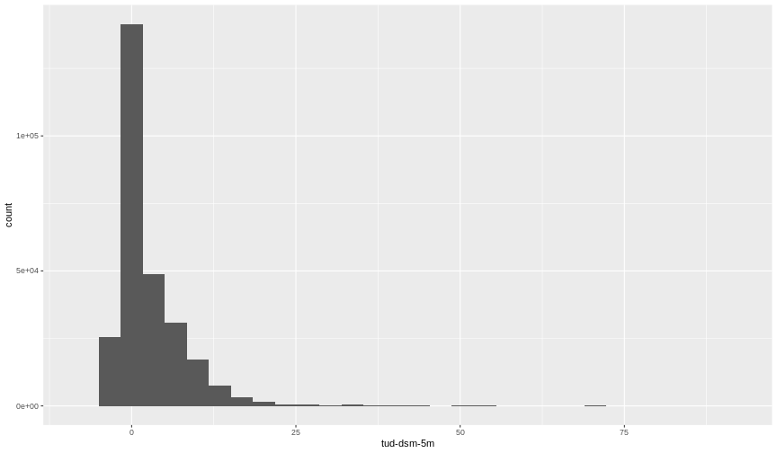
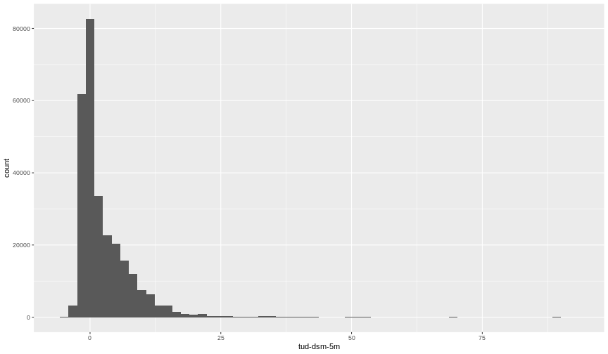

::: questions 
- What is a raster dataset?
- How do I work with and plot raster data in R?
:::

::: objectives

After completing this episode, participants should be able to…

- Explore raster attributes and metadata using R.
- Import rasters into R using the `terra` package.
- Plot a raster file in R using the `ggplot2` package.
- Describe the difference between single- and multi-band rasters.

:::

::: prereq

# Things you'll need to complete this episode

See the [setup instructions](../learners/setup.md) for detailed information about the software, data, and other prerequisites you will need to work through the examples in this episode.

<!-- This lesson uses the `terra` package in particular. If you have not installed it yet, do so by running `install.packages("terra")` before loading it with `library(terra)`. -->

:::

In this lesson, we will work with raster data. We will start with an introduction of the fundamental principles and metadata needed to work with raster data in R. We will discuss some of the core metadata elements needed to understand raster data in R, including CRS and resolution. 

We continue to work with the `tidyverse` package and we will use the `terra` package to work with raster data. Make sure that you have those packages loaded.


```r
library(tidyverse)
library(terra)
```

::: callout

# The data used in this lesson

In this and lesson, we will use:

- data extracted from the [AHN digital elevation dataset of the Netherlands](https://www.ahn.nl/) for the TU Delft campus area; and
- high-resolution RGB aerial photos of the TU Delft library obtained from [Beeldmateriaal Nederland](https://www.beeldmateriaal.nl/download-luchtfotos).

:::

## View Raster File Attributes

We will be working with a series of GeoTIFF files in this lesson. The GeoTIFF format contains a set of embedded tags with metadata about the raster data. We can use the function `describe()` from the `terra` package to get information about our raster data before we read that data into R. It is recommended to do this before importing your data. We first examine the file `tud-dsm-5m.tif`.


```r
describe("data/tud-dsm-5m.tif")
```

```output
 [1] "Driver: GTiff/GeoTIFF"                                                                                                 
 [2] "Files: data/tud-dsm-5m.tif"                                                                                            
 [3] "Size is 722, 386"                                                                                                      
 [4] "Coordinate System is:"                                                                                                 
 [5] "PROJCRS[\"Amersfoort / RD New\","                                                                                      
 [6] "    BASEGEOGCRS[\"Amersfoort\","                                                                                       
 [7] "        DATUM[\"Amersfoort\","                                                                                         
 [8] "            ELLIPSOID[\"Bessel 1841\",6377397.155,299.1528128,"                                                        
 [9] "                LENGTHUNIT[\"metre\",1]]],"                                                                            
[10] "        PRIMEM[\"Greenwich\",0,"                                                                                       
[11] "            ANGLEUNIT[\"degree\",0.0174532925199433]],"                                                                
[12] "        ID[\"EPSG\",4289]],"                                                                                           
[13] "    CONVERSION[\"RD New\","                                                                                            
[14] "        METHOD[\"Oblique Stereographic\","                                                                             
[15] "            ID[\"EPSG\",9809]],"                                                                                       
[16] "        PARAMETER[\"Latitude of natural origin\",52.1561605555556,"                                                    
[17] "            ANGLEUNIT[\"degree\",0.0174532925199433],"                                                                 
[18] "            ID[\"EPSG\",8801]],"                                                                                       
[19] "        PARAMETER[\"Longitude of natural origin\",5.38763888888889,"                                                   
[20] "            ANGLEUNIT[\"degree\",0.0174532925199433],"                                                                 
[21] "            ID[\"EPSG\",8802]],"                                                                                       
[22] "        PARAMETER[\"Scale factor at natural origin\",0.9999079,"                                                       
[23] "            SCALEUNIT[\"unity\",1],"                                                                                   
[24] "            ID[\"EPSG\",8805]],"                                                                                       
[25] "        PARAMETER[\"False easting\",155000,"                                                                           
[26] "            LENGTHUNIT[\"metre\",1],"                                                                                  
[27] "            ID[\"EPSG\",8806]],"                                                                                       
[28] "        PARAMETER[\"False northing\",463000,"                                                                          
[29] "            LENGTHUNIT[\"metre\",1],"                                                                                  
[30] "            ID[\"EPSG\",8807]]],"                                                                                      
[31] "    CS[Cartesian,2],"                                                                                                  
[32] "        AXIS[\"easting (X)\",east,"                                                                                    
[33] "            ORDER[1],"                                                                                                 
[34] "            LENGTHUNIT[\"metre\",1]],"                                                                                 
[35] "        AXIS[\"northing (Y)\",north,"                                                                                  
[36] "            ORDER[2],"                                                                                                 
[37] "            LENGTHUNIT[\"metre\",1]],"                                                                                 
[38] "    USAGE["                                                                                                            
[39] "        SCOPE[\"Engineering survey, topographic mapping.\"],"                                                          
[40] "        AREA[\"Netherlands - onshore, including Waddenzee, Dutch Wadden Islands and 12-mile offshore coastal zone.\"],"
[41] "        BBOX[50.75,3.2,53.7,7.22]],"                                                                                   
[42] "    ID[\"EPSG\",28992]]"                                                                                               
[43] "Data axis to CRS axis mapping: 1,2"                                                                                    
[44] "Origin = (83565.000000000000000,447180.000000000000000)"                                                               
[45] "Pixel Size = (5.000000000000000,-5.000000000000000)"                                                                   
[46] "Metadata:"                                                                                                             
[47] "  AREA_OR_POINT=Area"                                                                                                  
[48] "Image Structure Metadata:"                                                                                             
[49] "  INTERLEAVE=BAND"                                                                                                     
[50] "Corner Coordinates:"                                                                                                   
[51] "Upper Left  (   83565.000,  447180.000) (  4d20'49.32\"E, 52d 0'33.67\"N)"                                             
[52] "Lower Left  (   83565.000,  445250.000) (  4d20'50.77\"E, 51d59'31.22\"N)"                                             
[53] "Upper Right (   87175.000,  447180.000) (  4d23'58.60\"E, 52d 0'35.30\"N)"                                             
[54] "Lower Right (   87175.000,  445250.000) (  4d23'59.98\"E, 51d59'32.85\"N)"                                             
[55] "Center      (   85370.000,  446215.000) (  4d22'24.67\"E, 52d 0' 3.27\"N)"                                             
[56] "Band 1 Block=722x2 Type=Float32, ColorInterp=Gray"                                                                     
```
We will be using this information throughout this episode. By the end of the episode, you will be able to explain and understand the output above.

## Open a Raster in R

Now that we've previewed the metadata for our GeoTIFF, let's import this raster dataset into R and explore its metadata more closely. We can use the `rast()` function to import a raster file in R.

::: callout
# Data tip - Object names  
To improve code readability, use file and object names that make it clear what is in the file. The raster data for this episode contain the TU Delft campus and its surroundings so we’ll use a naming convention of `datatype_TUD`. The first object is a Digital Surface Model (DSM) in GeoTIFF format stored in a file `tud-dsm-5m.tif` which we will load into an object named according to our naming convention `DSM_TUD`.
:::

First we will load our raster file into R and view the data structure.


```r
DSM_TUD <- rast("data/tud-dsm-5m.tif")
DSM_TUD
```

```output
class       : SpatRaster 
dimensions  : 386, 722, 1  (nrow, ncol, nlyr)
resolution  : 5, 5  (x, y)
extent      : 83565, 87175, 445250, 447180  (xmin, xmax, ymin, ymax)
coord. ref. : Amersfoort / RD New (EPSG:28992) 
source      : tud-dsm-5m.tif 
name        : tud-dsm-5m 
```
The information above includes a report on dimension, resolution, extent and CRS, but no information about the values. Similar to other data structures in R like vectors and data frame columns, descriptive statistics for raster data can be retrieved with the `summary()` function.


```r
summary(DSM_TUD)
```

```warning
Warning: [summary] used a sample
```

```output
   tud.dsm.5m     
 Min.   :-5.2235  
 1st Qu.:-0.7007  
 Median : 0.5462  
 Mean   : 2.5850  
 3rd Qu.: 4.4596  
 Max.   :89.7838  
```

This output gives us information about the range of values in the DSM. We can see, for instance, that the lowest elevation is `-5.2235`, the highest is `89.7838`. But note the warning. Unless you force R to calculate these statistics using every cell in the raster, it will take a random sample of 100,000 cells and calculate from them instead. To force calculation all the values, you can use the function `values`:


```r
summary(values(DSM_TUD))
```

```output
   tud-dsm-5m     
 Min.   :-5.3907  
 1st Qu.:-0.7008  
 Median : 0.5573  
 Mean   : 2.5886  
 3rd Qu.: 4.4648  
 Max.   :92.0810  
```

With a summary on all cells of the raster, the values range from a smaller minimum of `-5.3907` to a higher maximum of `92.0910`.

To visualise the DSM in R using `ggplot2`, we need to convert it to a data frame. We learned about data frames in an [earlier lesson](../episodes/03-explore-data.Rmd). The `terra` package has the built-in function `as.data.frame()` for conversion to a data frame.


```r
DSM_TUD_df <- as.data.frame(DSM_TUD, xy = TRUE)
```

Now when we view the structure of our data, we will see a standard data frame format.


```r
str(DSM_TUD_df)
```

```output
'data.frame':	278692 obs. of  3 variables:
 $ x         : num  83568 83572 83578 83582 83588 ...
 $ y         : num  447178 447178 447178 447178 447178 ...
 $ tud-dsm-5m: num  10.34 8.64 1.25 1.12 2.13 ...
```

We can use `ggplot()` to plot this data with a specific `geom_` function called `geom_raster()`. We will make the colour scale in our plot colour-blindness friendly with `scale_fill_viridis_c`, introduced in an [earlier lesson](../episodes/04-intro-to-visualisation.Rmd). We will also use the `coord_quickmap()` function to use an approximate Mercator projection for our plots. This approximation is suitable for small areas that are not too close to the poles. Other coordinate systems are available in `ggplot2` if needed, you can learn about them at their help page `?coord_map`.


```r
ggplot() +
    geom_raster(data = DSM_TUD_df , aes(x = x, y = y, fill = `tud-dsm-5m`)) +
    scale_fill_viridis_c(option = "H") +  # `option = "H"` provides a contrasting colour scale
    coord_quickmap() 
```

<div class="figure" style="text-align: center">

<p class="caption">Raster plot with `ggplot2` using the viridis color scale</p>
</div>

::: callout
# Plotting tip

More information about the viridis palette used above at [viridis package documentation](https://cran.r-project.org/web/packages/viridis/vignettes/intro-to-viridis.html).
:::

::: callout
# Plotting tip

For faster previews, you can use the `plot()` function on a `terra` object.
:::

This map shows our Digital Surface Model, that is, the elevation of our study site including buildings and vegetation. From the legend we can confirm that the maximum elevation is around 90, but we cannot tell whether this is 90 feet or 90 meters because the legend doesn’t show us the units. We can look at the metadata of our object to see what the units are. Much of the metadata that we’re interested in is part of the CRS.

Now we will see how features of the CRS appear in our data file and what meanings they have.

## View Raster Coordinate Reference System (CRS) in R

We can view the CRS string associated with our R object using the `crs()` function.


```r
crs(DSM_TUD, proj = TRUE)
```

```output
[1] "+proj=sterea +lat_0=52.1561605555556 +lon_0=5.38763888888889 +k=0.9999079 +x_0=155000 +y_0=463000 +ellps=bessel +units=m +no_defs"
```

::: challenge
What units are our data in?

::: solution

`+units=m` in the output of the code above tells us that our data is in meters (m).

:::
:::

::: callout
# Understanding CRS in PROJ.4 format

The CRS for our data is given to us by R in PROJ.4 format. Let’s break down the pieces of a PROJ.4 string. The string contains all of the individual CRS elements that R or another GIS might need. Each element is specified with a `+` sign, similar to how a `.csv` file is delimited or broken up by a `,`. After each `+` we see the CRS element such as projection (`proj=`) being defined.

See more about CRS and PROJ.4 strings in [this lesson](https://datacarpentry.org/organization-geospatial/03-crs).
:::

## Calculate Raster Min and Max values

It is useful to know the minimum and maximum values of a raster dataset. In this case, as we are working with elevation data, these values represent the min/max elevation range at our site.

Raster statistics are often calculated and embedded in a GeoTIFF for us. We can view these values:

```r
minmax(DSM_TUD)
```

```output
    tud-dsm-5m
min        Inf
max       -Inf
```

::: callout
# Data tip - Set min and max values

If the `min` and `max` values are `Inf` and `-Inf` respectively, it means that they haven't been calculated. We can calculate them using the `setMinMax()` function.


```r
DSM_TUD <- setMinMax(DSM_TUD)
```
:::


```r
min(values(DSM_TUD))
```

```output
[1] -5.39069
```


```r
max(values(DSM_TUD))
```

```output
[1] 92.08102
```


We can see that the elevation at our site ranges from `-5.39069`m to `92.08102`m.

## Raster bands

The Digital Surface Model object (`DSM_TUD`) that we’ve been working with is a single band raster. This means that there is only one dataset stored in the raster: surface elevation in meters for one time period.


A raster dataset can contain one or more bands. We can view the number of bands in a raster using the `nlyr()` function.


```r
nlyr(DSM_TUD)
```

```output
[1] 1
```
This dataset has only 1 band. However, raster data can also be multi-band, meaning that one raster file contains data for more than one variable or time period for each cell. We will discuss multi-band raster data in a [later episode](../episodes/17-work-with-multi-band-rasters.Rmd).


## Creating a histogram of raster values

A histogram can be used to inspect the distribution of raster values visually. It can show if there are values above the max or below the min of the expected range. 

We can inspect the distribution of values contained in a raster using the `ggplot2` function `geom_histogram()`. Histograms are often useful in identifying outliers and bad data values in our raster data.


```r
ggplot() +
  geom_histogram(data = DSM_TUD_df, aes(`tud-dsm-5m`))
```

```output
`stat_bin()` using `bins = 30`. Pick better value with `binwidth`.
```



Notice that a message is displayed when R creates the histogram:

```
`stat_bin()` using `bins = 30`. Pick better value with `binwidth`.
```

This message is caused by a default setting in `geom_histogram()` enforcing that there are 30 bins for the data. We can define the number of bins we want in the histogram by giving another value to the `bins` argument. 60 bins, for instance, will give a more detailed histogram of the same distribution:


```r
ggplot() +
  geom_histogram(data = DSM_TUD_df, aes(`tud-dsm-5m`), bins = 60)
```



Note that the shape of this histogram looks similar to the previous one that was created using the default of 30 bins. The distribution of elevation values for our Digital Surface Model (DSM) looks reasonable. It is likely that there are no bad data values in this particular raster.

::: challenge

# Challenge: Explore raster metadata

Use `describe()` to determine the following about the `tud-dsm-hill.tif` file:

1. Does this file have the same CRS as `DSM_TUD`?
2. What is the resolution of the raster data?
3. How large would a 5x5 pixel area be on the Earth’s surface?
4. Is the file a multi- or single-band raster?

Note that this file is a hillshade raster. We will learn about hillshades in the [Working with Multi-band Rasters in R](../episodes/17-work-with-multi-band-rasters.Rmd) episode.

::: solution


```r
describe("data/tud-dsm-5m-hill.tif")
```

```output
 [1] "Driver: GTiff/GeoTIFF"                                                                                                 
 [2] "Files: data/tud-dsm-5m-hill.tif"                                                                                       
 [3] "Size is 722, 386"                                                                                                      
 [4] "Coordinate System is:"                                                                                                 
 [5] "PROJCRS[\"Amersfoort / RD New\","                                                                                      
 [6] "    BASEGEOGCRS[\"Amersfoort\","                                                                                       
 [7] "        DATUM[\"Amersfoort\","                                                                                         
 [8] "            ELLIPSOID[\"Bessel 1841\",6377397.155,299.1528128,"                                                        
 [9] "                LENGTHUNIT[\"metre\",1]]],"                                                                            
[10] "        PRIMEM[\"Greenwich\",0,"                                                                                       
[11] "            ANGLEUNIT[\"degree\",0.0174532925199433]],"                                                                
[12] "        ID[\"EPSG\",4289]],"                                                                                           
[13] "    CONVERSION[\"RD New\","                                                                                            
[14] "        METHOD[\"Oblique Stereographic\","                                                                             
[15] "            ID[\"EPSG\",9809]],"                                                                                       
[16] "        PARAMETER[\"Latitude of natural origin\",52.1561605555556,"                                                    
[17] "            ANGLEUNIT[\"degree\",0.0174532925199433],"                                                                 
[18] "            ID[\"EPSG\",8801]],"                                                                                       
[19] "        PARAMETER[\"Longitude of natural origin\",5.38763888888889,"                                                   
[20] "            ANGLEUNIT[\"degree\",0.0174532925199433],"                                                                 
[21] "            ID[\"EPSG\",8802]],"                                                                                       
[22] "        PARAMETER[\"Scale factor at natural origin\",0.9999079,"                                                       
[23] "            SCALEUNIT[\"unity\",1],"                                                                                   
[24] "            ID[\"EPSG\",8805]],"                                                                                       
[25] "        PARAMETER[\"False easting\",155000,"                                                                           
[26] "            LENGTHUNIT[\"metre\",1],"                                                                                  
[27] "            ID[\"EPSG\",8806]],"                                                                                       
[28] "        PARAMETER[\"False northing\",463000,"                                                                          
[29] "            LENGTHUNIT[\"metre\",1],"                                                                                  
[30] "            ID[\"EPSG\",8807]]],"                                                                                      
[31] "    CS[Cartesian,2],"                                                                                                  
[32] "        AXIS[\"easting (X)\",east,"                                                                                    
[33] "            ORDER[1],"                                                                                                 
[34] "            LENGTHUNIT[\"metre\",1]],"                                                                                 
[35] "        AXIS[\"northing (Y)\",north,"                                                                                  
[36] "            ORDER[2],"                                                                                                 
[37] "            LENGTHUNIT[\"metre\",1]],"                                                                                 
[38] "    USAGE["                                                                                                            
[39] "        SCOPE[\"Engineering survey, topographic mapping.\"],"                                                          
[40] "        AREA[\"Netherlands - onshore, including Waddenzee, Dutch Wadden Islands and 12-mile offshore coastal zone.\"],"
[41] "        BBOX[50.75,3.2,53.7,7.22]],"                                                                                   
[42] "    ID[\"EPSG\",28992]]"                                                                                               
[43] "Data axis to CRS axis mapping: 1,2"                                                                                    
[44] "Origin = (83565.000000000000000,447180.000000000000000)"                                                               
[45] "Pixel Size = (5.000000000000000,-5.000000000000000)"                                                                   
[46] "Metadata:"                                                                                                             
[47] "  AREA_OR_POINT=Area"                                                                                                  
[48] "Image Structure Metadata:"                                                                                             
[49] "  INTERLEAVE=BAND"                                                                                                     
[50] "Corner Coordinates:"                                                                                                   
[51] "Upper Left  (   83565.000,  447180.000) (  4d20'49.32\"E, 52d 0'33.67\"N)"                                             
[52] "Lower Left  (   83565.000,  445250.000) (  4d20'50.77\"E, 51d59'31.22\"N)"                                             
[53] "Upper Right (   87175.000,  447180.000) (  4d23'58.60\"E, 52d 0'35.30\"N)"                                             
[54] "Lower Right (   87175.000,  445250.000) (  4d23'59.98\"E, 51d59'32.85\"N)"                                             
[55] "Center      (   85370.000,  446215.000) (  4d22'24.67\"E, 52d 0' 3.27\"N)"                                             
[56] "Band 1 Block=722x11 Type=Byte, ColorInterp=Gray"                                                                       
[57] "  NoData Value=0"                                                                                                      
```

:::

:::

::: callout
# More resources

- See the manual and tutorials of the `terra` package on [https://rspatial.org/](https://rspatial.org/).
:::

::::::::::::::::::::::::::::::::::::: keypoints 

- The GeoTIFF file format includes metadata about the raster data.
- To plot raster data with the `ggplot2` package, we need to convert them to data frames.
- R stores CRS information in the PROJ.4 format.
- Histograms are useful to identify missing or bad data values.

::::::::::::::::::::::::::::::::::::::::::::::::

