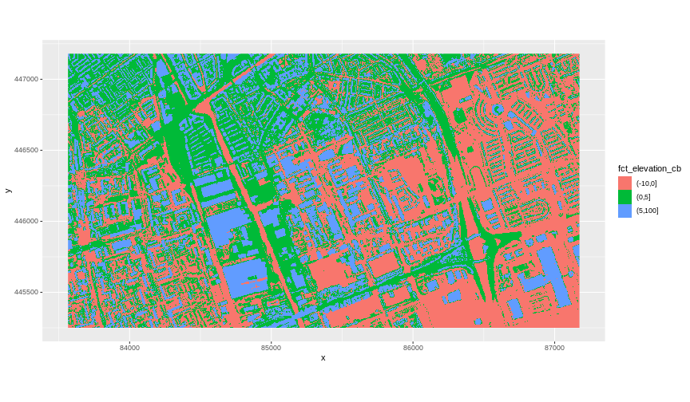
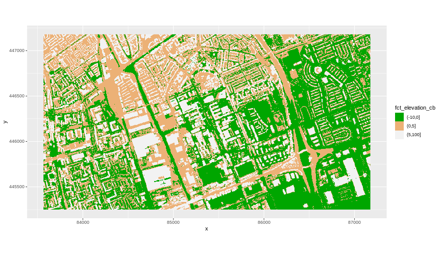
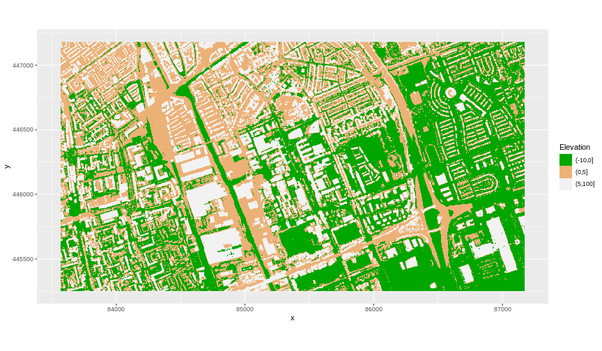
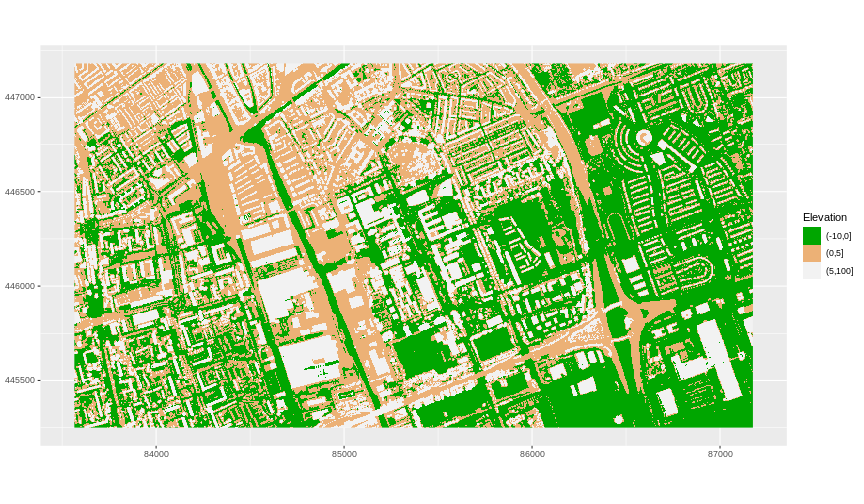
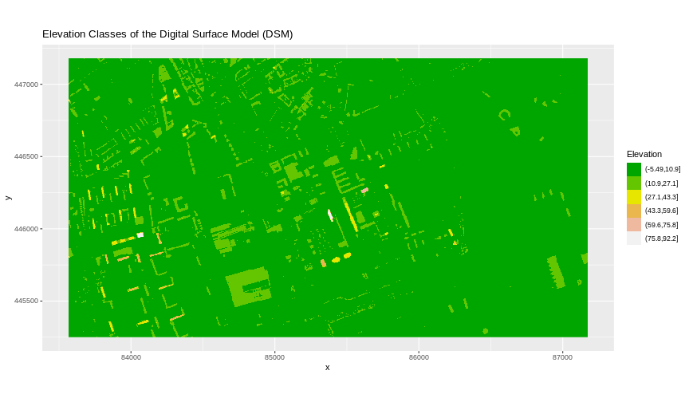

:::::::::::::::::::::::::::::::::::::: questions 

- How can I create categorized or customized maps of raster data?
- How can I customize the colour scheme of a raster image?

::::::::::::::::::::::::::::::::::::::::::::::::

::::::::::::::::::::::::::::::::::::: objectives

After completing this episode, participants should be able to…

- Build customized plots for a single band raster using the `ggplot2` package.

::::::::::::::::::::::::::::::::::::::::::::::::

::: prereq

# Things you'll need to complete this episode

See the [setup instructions](../learners/setup.md) for detailed information about the software, data, and other prerequisites you will need to work through the examples in this episode.

<!-- This lesson uses the `terra` package in particular. If you have not installed it yet, do so by running `install.packages("terra")` before loading it with `library(terra)`. -->

:::

In this part, we will plot our raster object using `ggplot2` with customized coloring schemes. We will continue working with the Digital Surface Model (DSM) raster from the [previous episode](../episodes/13-intro-to-raster-data.Rmd).

### Plotting Data Using Breaks
In the previous plot, our DSM was coloured with a continuous colour range. For clarity and visibility, we may prefer to view the data “symbolized” or coloured according to ranges of values. This is comparable to a “classified” map. For that, we need to tell `ggplot()` how many groups to break our data into and where those breaks should be. To make these decisions, it is useful to first explore the distribution of the data using a bar plot. To begin with, we will use `dplyr`’s `mutate()` function combined with `cut()` to split the data into 3 bins.


```r
DSM_TUD_df <- DSM_TUD_df %>%
  mutate(fct_elevation = cut(`tud-dsm-5m`, breaks = 3))

ggplot() +
    geom_bar(data = DSM_TUD_df, aes(fct_elevation))
```


To see the cut-off values for the groups, we can ask for the levels of `fct_elevation`:

```r
levels(DSM_TUD_df$fct_elevation)
```

```output
[1] "(-5.49,27.1]" "(27.1,59.6]"  "(59.6,92.2]" 
```

And we can get the count of values (that is, number of pixels) in each group using `dplyr`’s `count()` function:

```r
DSM_TUD_df %>% 
  count(fct_elevation)
```

```output
  fct_elevation      n
1  (-5.49,27.1] 277100
2   (27.1,59.6]   1469
3   (59.6,92.2]    123
```

We might prefer to customize the cut-off values for these groups. Lets round the cut-off values so that we have groups for the ranges of -10 - 0m, 0 - 5m, and 5 - 100m. To implement this we will give `cut()` a numeric vector of break points instead of the number of breaks we want.


```r
custom_bins <- c(-10, 0, 5, 100)

DSM_TUD_df <- DSM_TUD_df %>%
  mutate(fct_elevation_cb = cut(`tud-dsm-5m`, breaks = custom_bins))

levels(DSM_TUD_df$fct_elevation_cb)
```

```output
[1] "(-10,0]" "(0,5]"   "(5,100]"
```

::: callout

# Data tip

Note that 4 break values will result in 3 bins of data.

The bin intervals are shown using `(` to mean exclusive and `]` to mean inclusive. For example: (0, 10] means “from 0 through 10”.

:::

And now we can plot our bar plot again, using the new groups:

```r
ggplot() +
  geom_bar(data = DSM_TUD_df, aes(fct_elevation_cb))
```


And we can get the count of values in each group in the same way we did before:

```r
DSM_TUD_df %>% 
  count(fct_elevation_cb)
```

```output
  fct_elevation_cb      n
1          (-10,0] 113877
2            (0,5] 101446
3          (5,100]  63369
```

We can use those groups to plot our raster data, with each group being a different colour:

```r
ggplot() +
  geom_raster(data = DSM_TUD_df , aes(x = x, y = y, fill = fct_elevation_cb)) + 
  coord_quickmap()
```


The plot above uses the default colours inside `ggplot2` for raster objects. We can specify our own colours to make the plot look a little nicer. R has a built in set of colours for plotting terrain, which are built in to the `terrain.colors()` function. Since we have three bins, we want to create a 3-colour palette:


```r
terrain.colors(3)
```

```output
[1] "#00A600" "#ECB176" "#F2F2F2"
```

The `terrain.colors()` function returns hex colours - each of these character strings represents a colour. To use these in our map, we pass them across using the `scale_fill_manual()` function.

```r
ggplot() +
 geom_raster(data = DSM_TUD_df , aes(x = x, y = y, fill = fct_elevation_cb)) + 
    scale_fill_manual(values = terrain.colors(3)) + 
    coord_quickmap()
```



## More Plot Formatting

If we need to create multiple plots using the same colour palette, we can create an R object (`my_col`) for the set of colours that we want to use. We can then quickly change the palette across all plots by modifying the `my_col` object, rather than each individual plot.

We can give the legend a more meaningful title by passing a value to the `name` argument of the `scale_fill_manual()` function.

```r
my_col <- terrain.colors(3)

ggplot() +
 geom_raster(data = DSM_TUD_df , aes(x = x, y = y,
                                      fill = fct_elevation_cb)) + 
    scale_fill_manual(values = my_col, name = "Elevation") + 
    coord_quickmap()
```


The axis labels x and y are not necessary, so we can turn them off by passing `element_blank()` to the relevant part of the `theme()` function.

```r
ggplot() +
 geom_raster(data = DSM_TUD_df , aes(x = x, y = y,
                                      fill = fct_elevation_cb)) + 
    scale_fill_manual(values = my_col, name = "Elevation") +
    theme(axis.title = element_blank()) + 
    coord_quickmap()
```




::: challenge

# Challenge: Plot Using Custom Breaks

Create a plot of the TU Delft Digital Surface Model (`DSM_TUD`) that has:

1. Six classified ranges of values (break points) that are evenly divided among the range of pixel values.
3. A plot title.

::: solution


```r
DSM_TUD_df <- DSM_TUD_df %>%
  mutate(fct_elevation_6 = cut(`tud-dsm-5m`, breaks = 6))

levels(DSM_TUD_df$fct_elevation_6)
```

```output
[1] "(-5.49,10.9]" "(10.9,27.1]"  "(27.1,43.3]"  "(43.3,59.6]"  "(59.6,75.8]" 
[6] "(75.8,92.2]" 
```

```r
my_col <- terrain.colors(6)

ggplot() +
  geom_raster(data = DSM_TUD_df, aes(x = x, y = y,
                                       fill = fct_elevation_6)) +
  scale_fill_manual(values = my_col, name = "Elevation") +
  coord_quickmap() +
  labs(title = "Elevation Classes of the Digital Surface Model (DSM)")
```



:::

:::

::::::::::::::::::::::::::::::::::::: keypoints 

- Continuous data ranges can be grouped into categories using `mutate()` and `cut()`.
- Use the built-in `terrain.colors()` or set your preferred colour scheme manually.

::::::::::::::::::::::::::::::::::::::::::::::::

