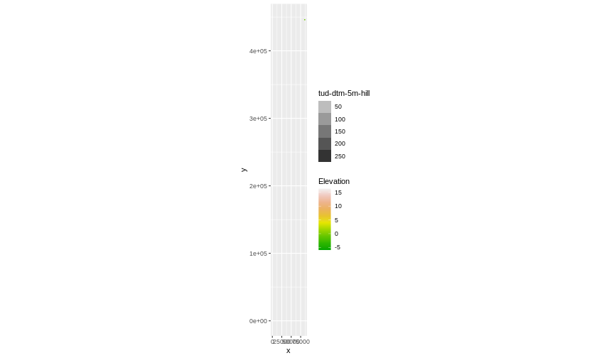
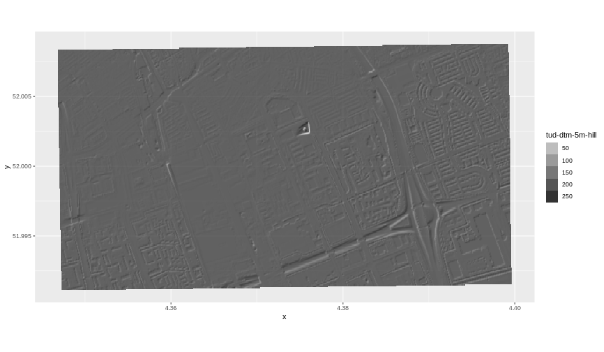
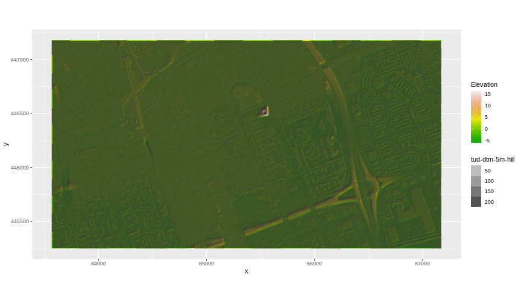

:::::::::::::::::::::::::::::::::::::: questions 

- How do I work with raster data sets that are in different projections?

::::::::::::::::::::::::::::::::::::::::::::::::

::::::::::::::::::::::::::::::::::::: objectives

After completing this episode, participants should be able to…

- Reproject a raster in R.

::::::::::::::::::::::::::::::::::::::::::::::::

::: prereq

# Things you'll need to complete this episode

See the [setup instructions](../learners/setup.md) for detailed information about the software, data, and other prerequisites you will need to work through the examples in this episode.

<!-- This lesson uses the `terra` package in particular. If you have not installed it yet, do so by running `install.packages("terra")` before loading it with `library(terra)`. -->

:::

Sometimes we encounter raster datasets that do not “line up” when plotted or analysed. Rasters that don’t line up are most often in different Coordinate Reference Systems (CRS). This episode explains how to deal with rasters in different CRS. It will walk through reprojecting rasters in R using the `project()` function in the `terra` package.


## Raster Projection

For this episode, we will be working with the Digital Terrain Model data. This differs from the surface model data we’ve been working with so far in that the digital surface model (DSM) includes the tops of trees and buildings, while the digital terrain model (DTM) shows the ground level.

We’ll be looking at another model (the canopy/building height model, or CHM) in [a later episode](../episodes/16-raster-calculations.Rmd) and will see how to calculate the CHM from the DSM and DTM. Here, we will create a map of the Digital Terrain Model (`DTM_TUD`) of TU Delft and its surrounding draped (or layered) on top of the hillshade (`DTM_hill_TUD`). 

:::::::::::::::::::::::::::::::::::::: callout

### Layering Rasters: Hillshade

We can layer a raster on top of a hillshade raster for the same area, and use a transparency factor to create a 3-dimensional shaded effect. A hillshade is a raster that maps the terrain using light and shadow to create a 3D-looking image that you would see from above when viewing the terrain. We will add a custom colour, making the plot grey.

Read more about layering raster [here](https://datacarpentry.org/r-raster-vector-geospatial/instructor/02-raster-plot.html#layering-rasters).

::::::::::::::::::::::::::::::::::::::::::::::::

First, we need to import the DTM and DTM hillshade data.


```r
DTM_TUD <- rast("data/tud-dtm-5m.tif")
DTM_hill_TUD <- rast("data/tud-dtm-5m-hill-WGS84.tif")
```

Next, we will convert each of these datasets to a data frame for plotting with `ggplot`.

```r
DTM_TUD_df <- as.data.frame(DTM_TUD, xy = TRUE)
DTM_hill_TUD_df <- as.data.frame(DTM_hill_TUD, xy = TRUE)
```

Now we can create a map of the DTM layered over the hillshade.

```r
ggplot() +
     geom_raster(data = DTM_TUD_df , 
                 aes(x = x, y = y, 
                  fill = `tud-dtm-5m`)) + 
     geom_raster(data = DTM_hill_TUD_df, 
                 aes(x = x, y = y, 
                   alpha = `tud-dtm-5m-hill`)) +
     scale_fill_gradientn(name = "Elevation", colors = terrain.colors(10)) +
     coord_quickmap()
```


Our results are curious - neither the Digital Terrain Model (`DTM_TUD_df`) nor the DTM Hillshade (`DTM_hill_TUD_df`) plotted. Let’s try to plot the DTM on its own to make sure there are data there.


```r
ggplot() +
  geom_raster(data = DTM_TUD_df,
              aes(x = x, y = y,
                  fill = `tud-dtm-5m`)) +
  scale_fill_gradientn(name = "Elevation", colors = terrain.colors(10)) +
  coord_quickmap()
```


Our DTM seems to contain data and plots just fine.

Next we plot the DTM Hillshade on its own to see whether everything is OK.


```r
ggplot() +
  geom_raster(data = DTM_hill_TUD_df,
              aes(x = x, y = y,
                  alpha = `tud-dtm-5m-hill`)) +
  coord_quickmap()
```



If we look at the axes, we can see that the units, and therefore the projections, of the two rasters are different. When this is the case, `ggplot2` won’t render the image. It won’t even throw an error message to tell you something has gone wrong. We can look at Coordinate Reference Systems (CRSs) of the DTM and the hillshade data to see how they differ.

::: challenge

# Exercise

View the CRS for each of these two datasets. What projection does each use?

::: solution


```r
crs(DTM_TUD, parse = TRUE)
```

```output
 [1] "PROJCRS[\"Amersfoort / RD New\","                                                                                      
 [2] "    BASEGEOGCRS[\"Amersfoort\","                                                                                       
 [3] "        DATUM[\"Amersfoort\","                                                                                         
 [4] "            ELLIPSOID[\"Bessel 1841\",6377397.155,299.1528128,"                                                        
 [5] "                LENGTHUNIT[\"metre\",1]]],"                                                                            
 [6] "        PRIMEM[\"Greenwich\",0,"                                                                                       
 [7] "            ANGLEUNIT[\"degree\",0.0174532925199433]],"                                                                
 [8] "        ID[\"EPSG\",4289]],"                                                                                           
 [9] "    CONVERSION[\"RD New\","                                                                                            
[10] "        METHOD[\"Oblique Stereographic\","                                                                             
[11] "            ID[\"EPSG\",9809]],"                                                                                       
[12] "        PARAMETER[\"Latitude of natural origin\",52.1561605555556,"                                                    
[13] "            ANGLEUNIT[\"degree\",0.0174532925199433],"                                                                 
[14] "            ID[\"EPSG\",8801]],"                                                                                       
[15] "        PARAMETER[\"Longitude of natural origin\",5.38763888888889,"                                                   
[16] "            ANGLEUNIT[\"degree\",0.0174532925199433],"                                                                 
[17] "            ID[\"EPSG\",8802]],"                                                                                       
[18] "        PARAMETER[\"Scale factor at natural origin\",0.9999079,"                                                       
[19] "            SCALEUNIT[\"unity\",1],"                                                                                   
[20] "            ID[\"EPSG\",8805]],"                                                                                       
[21] "        PARAMETER[\"False easting\",155000,"                                                                           
[22] "            LENGTHUNIT[\"metre\",1],"                                                                                  
[23] "            ID[\"EPSG\",8806]],"                                                                                       
[24] "        PARAMETER[\"False northing\",463000,"                                                                          
[25] "            LENGTHUNIT[\"metre\",1],"                                                                                  
[26] "            ID[\"EPSG\",8807]]],"                                                                                      
[27] "    CS[Cartesian,2],"                                                                                                  
[28] "        AXIS[\"easting (X)\",east,"                                                                                    
[29] "            ORDER[1],"                                                                                                 
[30] "            LENGTHUNIT[\"metre\",1]],"                                                                                 
[31] "        AXIS[\"northing (Y)\",north,"                                                                                  
[32] "            ORDER[2],"                                                                                                 
[33] "            LENGTHUNIT[\"metre\",1]],"                                                                                 
[34] "    USAGE["                                                                                                            
[35] "        SCOPE[\"Engineering survey, topographic mapping.\"],"                                                          
[36] "        AREA[\"Netherlands - onshore, including Waddenzee, Dutch Wadden Islands and 12-mile offshore coastal zone.\"],"
[37] "        BBOX[50.75,3.2,53.7,7.22]],"                                                                                   
[38] "    ID[\"EPSG\",28992]]"                                                                                               
```


```r
crs(DTM_hill_TUD, parse = TRUE)
```

```output
 [1] "GEOGCRS[\"WGS 84\","                                   
 [2] "    DATUM[\"World Geodetic System 1984\","             
 [3] "        ELLIPSOID[\"WGS 84\",6378137,298.257223563,"   
 [4] "            LENGTHUNIT[\"metre\",1]]],"                
 [5] "    PRIMEM[\"Greenwich\",0,"                           
 [6] "        ANGLEUNIT[\"degree\",0.0174532925199433]],"    
 [7] "    CS[ellipsoidal,2],"                                
 [8] "        AXIS[\"geodetic latitude (Lat)\",north,"       
 [9] "            ORDER[1],"                                 
[10] "            ANGLEUNIT[\"degree\",0.0174532925199433]],"
[11] "        AXIS[\"geodetic longitude (Lon)\",east,"       
[12] "            ORDER[2],"                                 
[13] "            ANGLEUNIT[\"degree\",0.0174532925199433]],"
[14] "    ID[\"EPSG\",4326]]"                                
```
`DTM_TUD` is in the Amersfoort / RD New projection, whereas `DTM_hill_TUD` is in WGS 84.

:::

:::

Because the two rasters are in different CRS, they don’t line up when plotted in R. We need to reproject (or change the projection of) `DTM_hill_TUD` into the Amersfoort / RD New CRS.

## Reproject Rasters

We can use the `project()` function to reproject a raster into a new CRS. Keep in mind that reprojection only works when you first have a defined CRS for the raster object that you want to reproject. It cannot be used if no CRS is defined. Lucky for us, DTM_hill_TUD has a defined CRS.

::: callout

# Data tip

When we reproject a raster, we move it from one “grid” to another. Thus, we are modifying the data! Keep this in mind as we work with raster data.

:::

To use the `project()` function, we need to define two things:

1. the object we want to reproject and
2. the CRS that we want to reproject it to.

The syntax is `project(RasterObject, crs)`

We want the CRS of our hillshade to match the `DTM_TUD` raster. We can thus assign the CRS of our `DTM_TUD` to our hillshade within the `project()` function as follows: `crs(DTM_TUD)`. Note that we are using the `project()` function on the raster object, not the `data.frame()` we use for plotting with `ggplot`.

First we will reproject our `DTM_hill_TUD` raster data to match the `DTM_TUD` raster CRS:

```r
DTM_hill_EPSG28992_TUD <- project(DTM_hill_TUD,
                                  crs(DTM_TUD))
```

Now we can compare the CRS of our original DTM hillshade and our new DTM hillshade, to see how they are different.

```r
crs(DTM_hill_EPSG28992_TUD, parse = TRUE)
```

```output
 [1] "PROJCRS[\"Amersfoort / RD New\","                                                                                      
 [2] "    BASEGEOGCRS[\"Amersfoort\","                                                                                       
 [3] "        DATUM[\"Amersfoort\","                                                                                         
 [4] "            ELLIPSOID[\"Bessel 1841\",6377397.155,299.1528128,"                                                        
 [5] "                LENGTHUNIT[\"metre\",1]]],"                                                                            
 [6] "        PRIMEM[\"Greenwich\",0,"                                                                                       
 [7] "            ANGLEUNIT[\"degree\",0.0174532925199433]],"                                                                
 [8] "        ID[\"EPSG\",4289]],"                                                                                           
 [9] "    CONVERSION[\"RD New\","                                                                                            
[10] "        METHOD[\"Oblique Stereographic\","                                                                             
[11] "            ID[\"EPSG\",9809]],"                                                                                       
[12] "        PARAMETER[\"Latitude of natural origin\",52.1561605555556,"                                                    
[13] "            ANGLEUNIT[\"degree\",0.0174532925199433],"                                                                 
[14] "            ID[\"EPSG\",8801]],"                                                                                       
[15] "        PARAMETER[\"Longitude of natural origin\",5.38763888888889,"                                                   
[16] "            ANGLEUNIT[\"degree\",0.0174532925199433],"                                                                 
[17] "            ID[\"EPSG\",8802]],"                                                                                       
[18] "        PARAMETER[\"Scale factor at natural origin\",0.9999079,"                                                       
[19] "            SCALEUNIT[\"unity\",1],"                                                                                   
[20] "            ID[\"EPSG\",8805]],"                                                                                       
[21] "        PARAMETER[\"False easting\",155000,"                                                                           
[22] "            LENGTHUNIT[\"metre\",1],"                                                                                  
[23] "            ID[\"EPSG\",8806]],"                                                                                       
[24] "        PARAMETER[\"False northing\",463000,"                                                                          
[25] "            LENGTHUNIT[\"metre\",1],"                                                                                  
[26] "            ID[\"EPSG\",8807]]],"                                                                                      
[27] "    CS[Cartesian,2],"                                                                                                  
[28] "        AXIS[\"easting (X)\",east,"                                                                                    
[29] "            ORDER[1],"                                                                                                 
[30] "            LENGTHUNIT[\"metre\",1]],"                                                                                 
[31] "        AXIS[\"northing (Y)\",north,"                                                                                  
[32] "            ORDER[2],"                                                                                                 
[33] "            LENGTHUNIT[\"metre\",1]],"                                                                                 
[34] "    USAGE["                                                                                                            
[35] "        SCOPE[\"Engineering survey, topographic mapping.\"],"                                                          
[36] "        AREA[\"Netherlands - onshore, including Waddenzee, Dutch Wadden Islands and 12-mile offshore coastal zone.\"],"
[37] "        BBOX[50.75,3.2,53.7,7.22]],"                                                                                   
[38] "    ID[\"EPSG\",28992]]"                                                                                               
```

```r
crs(DTM_hill_TUD, parse = TRUE)
```

```output
 [1] "GEOGCRS[\"WGS 84\","                                   
 [2] "    DATUM[\"World Geodetic System 1984\","             
 [3] "        ELLIPSOID[\"WGS 84\",6378137,298.257223563,"   
 [4] "            LENGTHUNIT[\"metre\",1]]],"                
 [5] "    PRIMEM[\"Greenwich\",0,"                           
 [6] "        ANGLEUNIT[\"degree\",0.0174532925199433]],"    
 [7] "    CS[ellipsoidal,2],"                                
 [8] "        AXIS[\"geodetic latitude (Lat)\",north,"       
 [9] "            ORDER[1],"                                 
[10] "            ANGLEUNIT[\"degree\",0.0174532925199433]],"
[11] "        AXIS[\"geodetic longitude (Lon)\",east,"       
[12] "            ORDER[2],"                                 
[13] "            ANGLEUNIT[\"degree\",0.0174532925199433]],"
[14] "    ID[\"EPSG\",4326]]"                                
```

We can also compare the extent of the two objects.

```r
ext(DTM_hill_EPSG28992_TUD)
```

```output
SpatExtent : 83537.3768729672, 87200.5199626113, 445202.584641046, 447230.395994242 (xmin, xmax, ymin, ymax)
```

```r
ext(DTM_hill_TUD)
```

```output
SpatExtent : 4.34674898644234, 4.39970436836596, 51.9910492930106, 52.0088368700157 (xmin, xmax, ymin, ymax)
```

## Deal with Raster Resolution

Let’s next have a look at the resolution of our reprojected hillshade versus our original data.


```r
res(DTM_hill_EPSG28992_TUD)
```

```output
[1] 5.03179 5.03179
```


```r
res(DTM_TUD)
```

```output
[1] 5 5
```

These two resolutions are different, but they’re representing the same data. We can tell R to force our newly reprojected raster to be the same as `DTM_TUD` by adding a line of code `res = res(DTM_TUD)` within the `project()` function.

```r
DTM_hill_EPSG28992_TUD <- project(DTM_hill_TUD, 
                                  crs(DTM_TUD),
                                  res = res(DTM_TUD))
```

Now both our resolutions and our CRSs match, so we can plot these two data sets together. Let’s double-check our resolution to be sure:

```r
res(DTM_hill_EPSG28992_TUD)
```

```output
[1] 5 5
```

```r
res(DTM_TUD)
```

```output
[1] 5 5
```

For plotting with `ggplot()`, we will need to create a data frame from our newly reprojected raster.

```r
DTM_hill_TUD_2_df <- as.data.frame(DTM_hill_EPSG28992_TUD, xy = TRUE)
```

We can now create a plot of this data.

```r
ggplot() +
     geom_raster(data = DTM_TUD_df , 
                 aes(x = x, y = y, 
                  fill = `tud-dtm-5m`)) + 
     geom_raster(data = DTM_hill_TUD_2_df, 
                 aes(x = x, y = y, 
                   alpha = `tud-dtm-5m-hill`)) +
     scale_fill_gradientn(name = "Elevation", colors = terrain.colors(10)) + 
     coord_equal()
```



We have now successfully draped the Digital Terrain Model on top of our hillshade to produce a nice looking, textured map!


::::::::::::::::::::::::::::::::::::: keypoints 

- In order to plot two raster data sets together, they must be in the same CRS.
- Use the `project()` function to convert between CRSs.

::::::::::::::::::::::::::::::::::::::::::::::::

