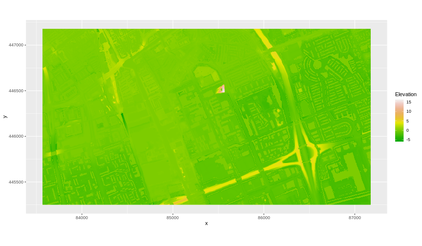
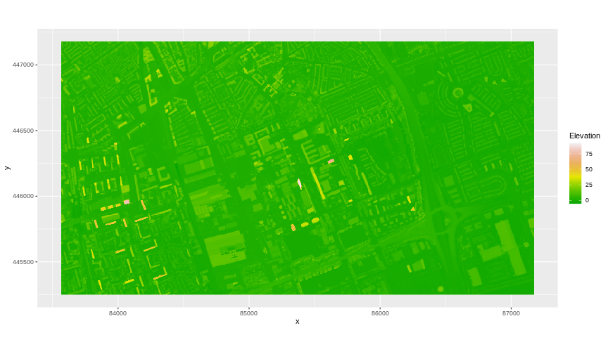
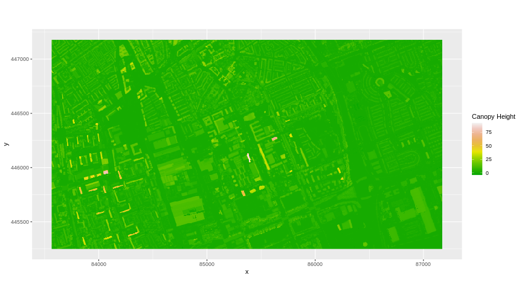

:::::::::::::::::::::::::::::::::::::: questions 

- How do I subtract one raster from another and extract pixel values for defined locations?

::::::::::::::::::::::::::::::::::::::::::::::::

::::::::::::::::::::::::::::::::::::: objectives

After completing this episode, participants should be able to…

- Perform a subtraction between two rasters using raster math.
- Export raster data as a GeoTIFF file.

::::::::::::::::::::::::::::::::::::::::::::::::

::: prereq

# Things you'll need to complete this episode

See the [setup instructions](../learners/setup.md) for detailed information about the software, data, and other prerequisites you will need to work through the examples in this episode.

<!-- This lesson uses the `terra` package in particular. If you have not installed it yet, do so by running `install.packages("terra")` before loading it with `library(terra)`. -->

:::

We often want to combine values of and perform calculations on rasters to create a new output raster. This episode covers how to subtract one raster from another using basic raster math.

## Raster calculations in R

We often want to perform calculations on two or more rasters to create a new output raster. For example, if we are interested in mapping the heights of trees and buildings across an entire field site, we might want to calculate the difference between the Digital Surface Model (DSM, tops of trees and buildings) and the Digital Terrain Model (DTM, ground level). The resulting dataset is referred to as a Canopy Height Model (CHM) and represents the actual height of trees, buildings, etc. with the influence of ground elevation removed.


## Load the Data

For this episode, we will use the DTM and DSM data which we already have loaded from previous episodes.

We use the `describe()` function to view information about the DTM and DSM data files. 

```r
describe("data/tud-dtm-5m.tif")
```

```output
 [1] "Driver: GTiff/GeoTIFF"                                                                                                 
 [2] "Files: data/tud-dtm-5m.tif"                                                                                            
 [3] "Size is 722, 386"                                                                                                      
 [4] "Coordinate System is:"                                                                                                 
 [5] "PROJCRS[\"Amersfoort / RD New\","                                                                                      
 [6] "    BASEGEOGCRS[\"Amersfoort\","                                                                                       
 [7] "        DATUM[\"Amersfoort\","                                                                                         
 [8] "            ELLIPSOID[\"Bessel 1841\",6377397.155,299.1528128,"                                                        
 [9] "                LENGTHUNIT[\"metre\",1]]],"                                                                            
[10] "        PRIMEM[\"Greenwich\",0,"                                                                                       
[11] "            ANGLEUNIT[\"degree\",0.0174532925199433]],"                                                                
[12] "        ID[\"EPSG\",4289]],"                                                                                           
[13] "    CONVERSION[\"RD New\","                                                                                            
[14] "        METHOD[\"Oblique Stereographic\","                                                                             
[15] "            ID[\"EPSG\",9809]],"                                                                                       
[16] "        PARAMETER[\"Latitude of natural origin\",52.1561605555556,"                                                    
[17] "            ANGLEUNIT[\"degree\",0.0174532925199433],"                                                                 
[18] "            ID[\"EPSG\",8801]],"                                                                                       
[19] "        PARAMETER[\"Longitude of natural origin\",5.38763888888889,"                                                   
[20] "            ANGLEUNIT[\"degree\",0.0174532925199433],"                                                                 
[21] "            ID[\"EPSG\",8802]],"                                                                                       
[22] "        PARAMETER[\"Scale factor at natural origin\",0.9999079,"                                                       
[23] "            SCALEUNIT[\"unity\",1],"                                                                                   
[24] "            ID[\"EPSG\",8805]],"                                                                                       
[25] "        PARAMETER[\"False easting\",155000,"                                                                           
[26] "            LENGTHUNIT[\"metre\",1],"                                                                                  
[27] "            ID[\"EPSG\",8806]],"                                                                                       
[28] "        PARAMETER[\"False northing\",463000,"                                                                          
[29] "            LENGTHUNIT[\"metre\",1],"                                                                                  
[30] "            ID[\"EPSG\",8807]]],"                                                                                      
[31] "    CS[Cartesian,2],"                                                                                                  
[32] "        AXIS[\"easting (X)\",east,"                                                                                    
[33] "            ORDER[1],"                                                                                                 
[34] "            LENGTHUNIT[\"metre\",1]],"                                                                                 
[35] "        AXIS[\"northing (Y)\",north,"                                                                                  
[36] "            ORDER[2],"                                                                                                 
[37] "            LENGTHUNIT[\"metre\",1]],"                                                                                 
[38] "    USAGE["                                                                                                            
[39] "        SCOPE[\"Engineering survey, topographic mapping.\"],"                                                          
[40] "        AREA[\"Netherlands - onshore, including Waddenzee, Dutch Wadden Islands and 12-mile offshore coastal zone.\"],"
[41] "        BBOX[50.75,3.2,53.7,7.22]],"                                                                                   
[42] "    ID[\"EPSG\",28992]]"                                                                                               
[43] "Data axis to CRS axis mapping: 1,2"                                                                                    
[44] "Origin = (83565.000000000000000,447180.000000000000000)"                                                               
[45] "Pixel Size = (5.000000000000000,-5.000000000000000)"                                                                   
[46] "Metadata:"                                                                                                             
[47] "  AREA_OR_POINT=Area"                                                                                                  
[48] "Image Structure Metadata:"                                                                                             
[49] "  INTERLEAVE=BAND"                                                                                                     
[50] "Corner Coordinates:"                                                                                                   
[51] "Upper Left  (   83565.000,  447180.000) (  4d20'49.32\"E, 52d 0'33.67\"N)"                                             
[52] "Lower Left  (   83565.000,  445250.000) (  4d20'50.77\"E, 51d59'31.22\"N)"                                             
[53] "Upper Right (   87175.000,  447180.000) (  4d23'58.60\"E, 52d 0'35.30\"N)"                                             
[54] "Lower Right (   87175.000,  445250.000) (  4d23'59.98\"E, 51d59'32.85\"N)"                                             
[55] "Center      (   85370.000,  446215.000) (  4d22'24.67\"E, 52d 0' 3.27\"N)"                                             
[56] "Band 1 Block=722x2 Type=Float32, ColorInterp=Gray"                                                                     
```

```r
describe("data/tud-dsm-5m.tif")
```

```output
 [1] "Driver: GTiff/GeoTIFF"                                                                                                 
 [2] "Files: data/tud-dsm-5m.tif"                                                                                            
 [3] "Size is 722, 386"                                                                                                      
 [4] "Coordinate System is:"                                                                                                 
 [5] "PROJCRS[\"Amersfoort / RD New\","                                                                                      
 [6] "    BASEGEOGCRS[\"Amersfoort\","                                                                                       
 [7] "        DATUM[\"Amersfoort\","                                                                                         
 [8] "            ELLIPSOID[\"Bessel 1841\",6377397.155,299.1528128,"                                                        
 [9] "                LENGTHUNIT[\"metre\",1]]],"                                                                            
[10] "        PRIMEM[\"Greenwich\",0,"                                                                                       
[11] "            ANGLEUNIT[\"degree\",0.0174532925199433]],"                                                                
[12] "        ID[\"EPSG\",4289]],"                                                                                           
[13] "    CONVERSION[\"RD New\","                                                                                            
[14] "        METHOD[\"Oblique Stereographic\","                                                                             
[15] "            ID[\"EPSG\",9809]],"                                                                                       
[16] "        PARAMETER[\"Latitude of natural origin\",52.1561605555556,"                                                    
[17] "            ANGLEUNIT[\"degree\",0.0174532925199433],"                                                                 
[18] "            ID[\"EPSG\",8801]],"                                                                                       
[19] "        PARAMETER[\"Longitude of natural origin\",5.38763888888889,"                                                   
[20] "            ANGLEUNIT[\"degree\",0.0174532925199433],"                                                                 
[21] "            ID[\"EPSG\",8802]],"                                                                                       
[22] "        PARAMETER[\"Scale factor at natural origin\",0.9999079,"                                                       
[23] "            SCALEUNIT[\"unity\",1],"                                                                                   
[24] "            ID[\"EPSG\",8805]],"                                                                                       
[25] "        PARAMETER[\"False easting\",155000,"                                                                           
[26] "            LENGTHUNIT[\"metre\",1],"                                                                                  
[27] "            ID[\"EPSG\",8806]],"                                                                                       
[28] "        PARAMETER[\"False northing\",463000,"                                                                          
[29] "            LENGTHUNIT[\"metre\",1],"                                                                                  
[30] "            ID[\"EPSG\",8807]]],"                                                                                      
[31] "    CS[Cartesian,2],"                                                                                                  
[32] "        AXIS[\"easting (X)\",east,"                                                                                    
[33] "            ORDER[1],"                                                                                                 
[34] "            LENGTHUNIT[\"metre\",1]],"                                                                                 
[35] "        AXIS[\"northing (Y)\",north,"                                                                                  
[36] "            ORDER[2],"                                                                                                 
[37] "            LENGTHUNIT[\"metre\",1]],"                                                                                 
[38] "    USAGE["                                                                                                            
[39] "        SCOPE[\"Engineering survey, topographic mapping.\"],"                                                          
[40] "        AREA[\"Netherlands - onshore, including Waddenzee, Dutch Wadden Islands and 12-mile offshore coastal zone.\"],"
[41] "        BBOX[50.75,3.2,53.7,7.22]],"                                                                                   
[42] "    ID[\"EPSG\",28992]]"                                                                                               
[43] "Data axis to CRS axis mapping: 1,2"                                                                                    
[44] "Origin = (83565.000000000000000,447180.000000000000000)"                                                               
[45] "Pixel Size = (5.000000000000000,-5.000000000000000)"                                                                   
[46] "Metadata:"                                                                                                             
[47] "  AREA_OR_POINT=Area"                                                                                                  
[48] "Image Structure Metadata:"                                                                                             
[49] "  INTERLEAVE=BAND"                                                                                                     
[50] "Corner Coordinates:"                                                                                                   
[51] "Upper Left  (   83565.000,  447180.000) (  4d20'49.32\"E, 52d 0'33.67\"N)"                                             
[52] "Lower Left  (   83565.000,  445250.000) (  4d20'50.77\"E, 51d59'31.22\"N)"                                             
[53] "Upper Right (   87175.000,  447180.000) (  4d23'58.60\"E, 52d 0'35.30\"N)"                                             
[54] "Lower Right (   87175.000,  445250.000) (  4d23'59.98\"E, 51d59'32.85\"N)"                                             
[55] "Center      (   85370.000,  446215.000) (  4d22'24.67\"E, 52d 0' 3.27\"N)"                                             
[56] "Band 1 Block=722x2 Type=Float32, ColorInterp=Gray"                                                                     
```

We’ve already loaded and worked with these two data files in earlier episodes. Let’s plot them each once more to remind ourselves what this data looks like. First we’ll plot the DTM elevation data:

```r
 ggplot() +
      geom_raster(data = DTM_TUD_df , 
              aes(x = x, y = y, fill = `tud-dtm-5m`)) +
     scale_fill_gradientn(name = "Elevation", colors = terrain.colors(10)) + 
     coord_quickmap()
```



And then the DSM elevation data:

```r
 ggplot() +
      geom_raster(data = DSM_TUD_df , 
              aes(x = x, y = y, fill = `tud-dsm-5m`)) +
     scale_fill_gradientn(name = "Elevation", colors = terrain.colors(10)) + 
     coord_quickmap()
```



## Raster math and Canopy Height Models

We can perform raster calculations by subtracting (or adding, multiplying, etc.) two rasters. In the geospatial world, we call this “raster math”.

Let’s subtract the DTM from the DSM to create a Canopy Height Model. After subtracting, let’s create a data frame so we can plot with `ggplot`.


```r
CHM_TUD <- DSM_TUD - DTM_TUD
CHM_TUD_df <- as.data.frame(CHM_TUD, xy = TRUE)
```

We can now plot the output CHM.

```r
 ggplot() +
   geom_raster(data = CHM_TUD_df , 
               aes(x = x, y = y, fill = `tud-dsm-5m`)) + 
   scale_fill_gradientn(name = "Canopy Height", colors = terrain.colors(10)) + 
   coord_quickmap()
```



Let’s have a look at the distribution of values in our newly created Canopy Height Model (CHM).

```r
ggplot(CHM_TUD_df) +
    geom_histogram(aes(`tud-dsm-5m`))
```


Notice that the range of values for the output CHM starts right below 0 and ranges to almost 100 meters. Does this make sense for buildings and trees in Delft?

::: challenge

### Challenge: Explore CHM Raster Values

It’s often a good idea to explore the range of values in a raster dataset just like we might explore a dataset that we collected in the field.

1. What is the minimum and maximum value for the Canopy Height Model `CHM_TUD` that we just created?
2. What is the distribution of all the pixel values in the CHM?
3. Plot the `CHM_TUD` raster using breaks that make sense for the data. Include an appropriate colour palette for the data, plot title and no axes ticks / labels.

::: solution


```r
min(CHM_TUD_df$`tud-dsm-5m`, na.rm = TRUE)
```

```output
[1] -3.638057
```

```r
max(CHM_TUD_df$`tud-dsm-5m`, na.rm = TRUE)
```

```output
[1] 92.08102
```

```r
ggplot(CHM_TUD_df) +
    geom_histogram(aes(`tud-dsm-5m`))
```


```r
custom_bins <- c(-5, 0, 10, 20, 30, 100)
CHM_TUD_df <- CHM_TUD_df %>%
                  mutate(canopy_discrete = cut(`tud-dsm-5m`, breaks = custom_bins))

ggplot() +
  geom_raster(data = CHM_TUD_df , aes(x = x, y = y,
                                       fill = canopy_discrete)) + 
     scale_fill_manual(values = terrain.colors(5)) + 
     coord_quickmap()
```


:::

:::

::: callout

### Two Ways to Perform Raster Calculations

We can calculate the difference between two rasters in two different ways:

- by directly subtracting the two rasters in R using raster math,

or for more efficient processing, particularly if our rasters are large and/or the calculations we are performing are complex:

- using the `lapp()` function.

See how `lapp()` is used in [this lesson](https://datacarpentry.org/r-raster-vector-geospatial/instructor/04-raster-calculations-in-r.html#efficient-raster-calculations).

:::

## Export a GeoTIFF

Now that we’ve created a new raster, let’s export the data as a GeoTIFF file using the `writeRaster()` function.

When we write this raster object to a GeoTIFF file we’ll name it `CHM_TUD.tiff`. This name allows us to quickly remember both what the data contains (CHM data) and for where (TU Delft campus and surroundings). The `writeRaster()` function by default writes the output file to your working directory unless you specify a full file path.

We will specify the output format (“GTiff”), the no data value `NAflag = -9999`. We will also tell R to overwrite any data that is already in a file of the same name.

```r
writeRaster(CHM_TUD, "fig/CHM_TUD.tiff",
            filetype="GTiff",
            overwrite=TRUE,
            NAflag=-9999)
```

::::::::::::::::::::::::::::::::::::: keypoints 

- Rasters can be computed on using mathematical functions.
- The `writeRaster()` function can be used to write raster data to a file.

::::::::::::::::::::::::::::::::::::::::::::::::

