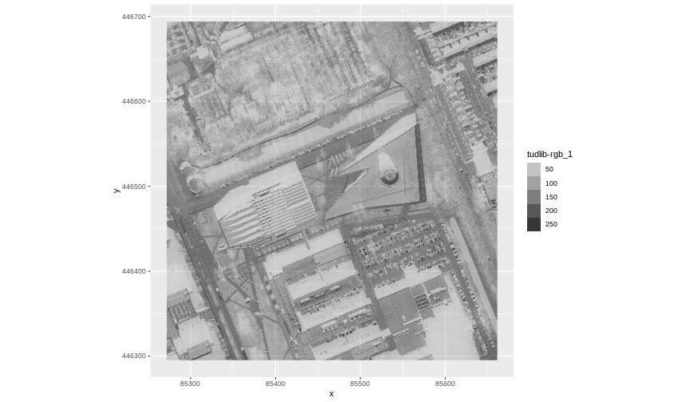
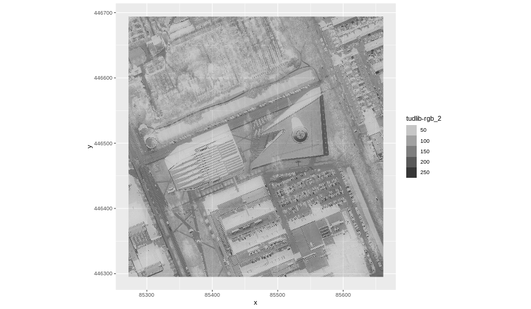
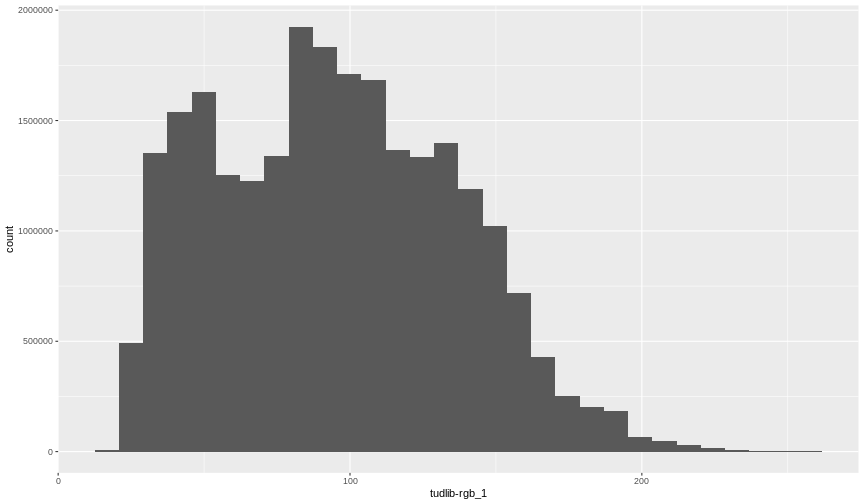

:::::::::::::::::::::::::::::::::::::: questions 

- How can I visualize individual and multiple bands in a raster object?

::::::::::::::::::::::::::::::::::::::::::::::::

::::::::::::::::::::::::::::::::::::: objectives

After completing this episode, participants should be able to…

- Identify a single versus a multi-band raster file.
- Import multi-band rasters into R using the `terra` package.
- Plot multi-band colour image rasters in R using the `ggplot` package.

::::::::::::::::::::::::::::::::::::::::::::::::

::: prereq

# Things you'll need to complete this episode

See the [setup instructions](../learners/setup.md) for detailed information about the software, data, and other prerequisites you will need to work through the examples in this episode.

<!-- This lesson uses the `terra` package in particular. If you have not installed it yet, do so by running `install.packages("terra")` before loading it with `library(terra)`. -->

:::

<!-- We introduced multi-band raster data in an [earlier lesson]().  -->
This episode explores how to import and plot a multi-band raster in R.

## Getting Started with Multi-Band Data in R

In this episode, the multi-band data that we are working with is [Beeldmateriaal Open Data](https://opendata.beeldmateriaal.nl/) from the Netherlands. Each RGB image is a 3-band raster. The same steps would apply to working with a multi-spectral image with 4 or more bands - like Landsat imagery.

By using the `rast()` function along with the `lyrs` parameter, we can read specific raster bands; omitting this parameter would read instead all bands.


```r
RGB_band1_TUD <- rast("data/tudlib-rgb.tif", lyrs = 1)
```

We need to convert this data to a data frame in order to plot it with `ggplot`.

```r
RGB_band1_TUD_df  <- as.data.frame(RGB_band1_TUD, xy = TRUE)

ggplot() +
  geom_raster(data = RGB_band1_TUD_df,
              aes(x = x, y = y, alpha = `tudlib-rgb_1`)) + 
  coord_equal()
```



## Image Raster Data Values

This raster contains values between 0 and 255. These values represent degrees of brightness associated with the image band. In the case of a RGB image (red, green and blue), band 1 is the red band. When we plot the red band, larger numbers (towards 255) represent pixels with more red in them (a strong red reflection). Smaller numbers (towards 0) represent pixels with less red in them (less red was reflected). To plot an RGB image, we mix red + green + blue values into one single colour to create a full colour image - similar to the colour image a digital camera creates.

## Import a Specific Band

We can use the `rast()` function to import specific bands in our raster object by specifying which band we want with `lyrs = N` (N represents the band number we want to work with). To import the green band, we would use `lyrs = 2`.


```r
RGB_band2_TUD <- rast("data/tudlib-rgb.tif", lyrs = 2)
```

We can convert this data to a data frame and plot the same way we plotted the red band:

```r
RGB_band2_TUD_df <- as.data.frame(RGB_band2_TUD, xy = TRUE)

ggplot() +
  geom_raster(data = RGB_band2_TUD_df,
              aes(x = x, y = y, alpha = `tudlib-rgb_2`)) + 
  coord_equal() 
```



## Raster Stacks

Next, we will work with all three image bands (red, green and blue) as an R raster object. We will then plot a 3-band composite, or full-colour, image.

To bring in all bands of a multi-band raster, we use the `rast()` function.

```r
RGB_stack_TUD <- rast("data/tudlib-rgb.tif")
```

Let’s preview the attributes of our stack object:

```r
RGB_stack_TUD
```

```output
class       : SpatRaster 
dimensions  : 4988, 4866, 3  (nrow, ncol, nlyr)
resolution  : 0.08, 0.08  (x, y)
extent      : 85272, 85661.28, 446295.2, 446694.2  (xmin, xmax, ymin, ymax)
coord. ref. : Amersfoort / RD New (EPSG:28992) 
source      : tudlib-rgb.tif 
colors RGB  : 1, 2, 3 
names       : tudlib-rgb_1, tudlib-rgb_2, tudlib-rgb_3 
```
We can view the attributes of each band in the stack in a single output. For example, if we had hundreds of bands, we could specify which band we’d like to view attributes for using an index value:

```r
RGB_stack_TUD[[2]]
```

```output
class       : SpatRaster 
dimensions  : 4988, 4866, 1  (nrow, ncol, nlyr)
resolution  : 0.08, 0.08  (x, y)
extent      : 85272, 85661.28, 446295.2, 446694.2  (xmin, xmax, ymin, ymax)
coord. ref. : Amersfoort / RD New (EPSG:28992) 
source      : tudlib-rgb.tif 
name        : tudlib-rgb_2 
```
We can also use `ggplot2` to plot the data in any layer of our raster object. Remember, we need to convert to a data frame first.


```r
RGB_stack_TUD_df <- as.data.frame(RGB_stack_TUD, xy = TRUE)
```

Each band in our RasterStack gets its own column in the data frame. Thus we have:

```r
str(RGB_stack_TUD_df)
```

```output
'data.frame':	24271608 obs. of  5 variables:
 $ x           : num  85272 85272 85272 85272 85272 ...
 $ y           : num  446694 446694 446694 446694 446694 ...
 $ tudlib-rgb_1: int  52 48 47 49 47 45 47 48 49 54 ...
 $ tudlib-rgb_2: int  64 58 57 60 57 55 58 59 62 69 ...
 $ tudlib-rgb_3: int  57 49 49 53 50 47 51 54 57 68 ...
```
Let’s create a histogram of the first band:

```r
ggplot() +
  geom_histogram(data = RGB_stack_TUD_df, aes(`tudlib-rgb_1`))
```


And a raster plot of the second band:

```r
ggplot() +
  geom_raster(data = RGB_stack_TUD_df,
              aes(x = x, y = y, alpha = `tudlib-rgb_2`)) + 
  coord_equal()
```


We can access any individual band in the same way.

## Create a three-band image

To render a final three-band, coloured image in R, we use the `plotRGB()` function.

This function allows us to:

- Identify what bands we want to render in the red, green and blue regions. The `plotRGB()` function defaults to a 1=red, 2=green, and 3=blue band order. However, you can define what bands you’d like to plot manually. Manual definition of bands is useful if you have, for example a near-infrared band and want to create a colour infrared image.
- Adjust the stretch of the image to increase or decrease contrast.

Let’s plot our 3-band image. Note that we can use the `plotRGB()` function directly with our RasterStack object (we don’t need a data frame as this function isn’t part of the `ggplot2` package).


```r
plotRGB(RGB_stack_TUD,
        r = 1, g = 2, b = 3)
```


The image above looks pretty good. We can explore whether applying a stretch to the image might improve clarity and contrast using stretch="lin" or stretch="hist", as explained in [this lesson](https://datacarpentry.org/r-raster-vector-geospatial/instructor/05-raster-multi-band-in-r.html#create-a-three-band-image).

::: callout

### SpatRaster in R

The R SpatRaster object type can handle rasters with multiple bands. The SpatRaster only holds parameters that describe the properties of raster data that is located somewhere on our computer.

A SpatRasterDataset object can hold references to sub-datasets, that is, SpatRaster objects. In most cases, we can work with a SpatRaster in the same way we might work with a SpatRasterDataset.

Read more about SpatRasters in [this lesson](https://datacarpentry.org/r-raster-vector-geospatial/instructor/05-raster-multi-band-in-r.html#spatraster-in-r).

:::

::::::::::::::::::::::::::::::::::::: keypoints 

- A single raster file can contain multiple bands or layers.
- Use the `rast()` function to load all bands in a multi-layer raster file into R.
- Individual bands within a SpatRaster can be accessed, analysed, and visualized using the same functions no matter how many bands it holds.

::::::::::::::::::::::::::::::::::::::::::::::::

