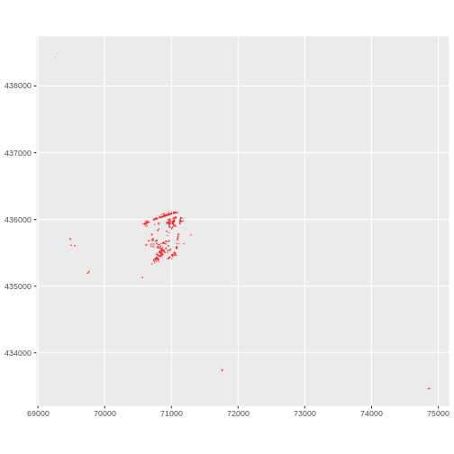
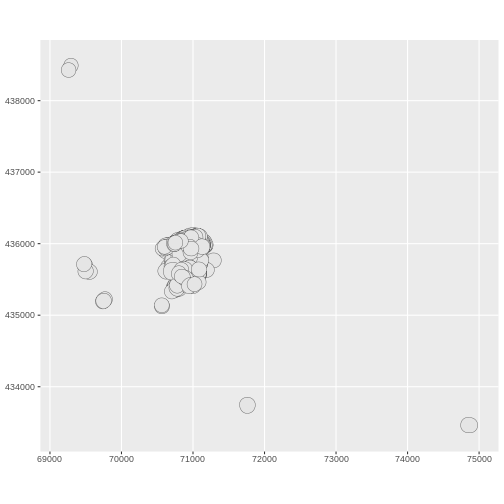
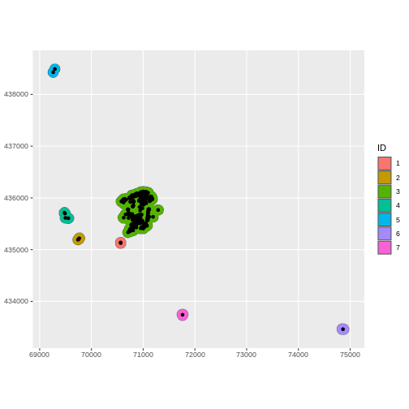
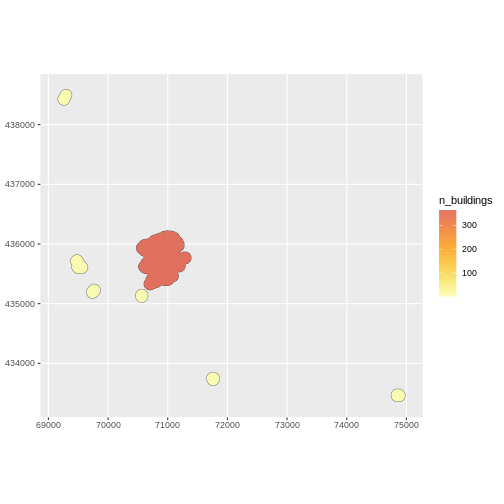
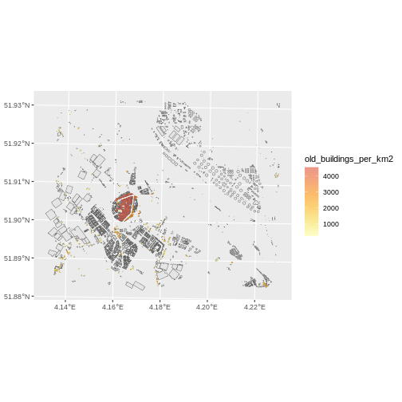
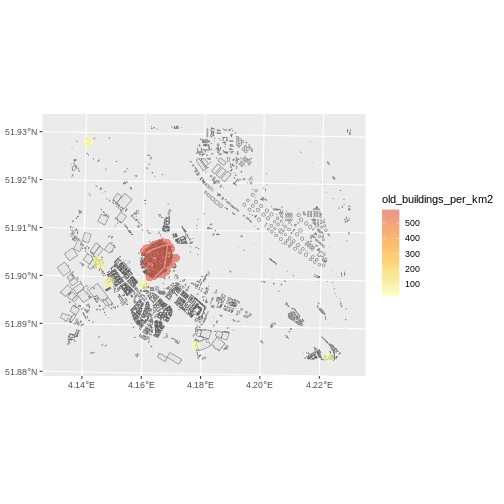

:::::::::::::::::::::::::::::::::::::: questions 

- How to perform basic GIS operations with the `sf` package?

::::::::::::::::::::::::::::::::::::::::::::::::

::::::::::::::::::::::::::::::::::::: objectives

After completing this episode, participants should be able to…

- Perform geoprocessing operations such as unions, joins and intersections with dedicated functions from the `sf` package
- Compute the area of spatial polygons
- Create buffers and centroids 
- Map and save the results

::::::::::::::::::::::::::::::::::::::::::::::::


```r
library(tidyverse)
library(sf)
library(osmdata)
library(leaflet)
library(lwgeom)
assign("has_internet_via_proxy", TRUE, environment(curl::has_internet))
```


## Why `sf` for GIS?

As introduced in [an earlier lesson](episodes/09-open-and-plot-vector-layers.Rmd), `sf` is a package which supports simple features (sf), ["a standardized way to
encode spatial vector data."](https://cran.r-project.org/web/packages/sf/sf.pdf).
It contains a large set of functions to achieve all the operations on vector spatial data for which you might use traditional GIS software: change the coordinate system, join layers, intersect or unite polygons, create buffers and centroids, etc. cf. the `sf` [cheatsheet](https://raw.githubusercontent.com/rstudio/cheatsheets/main/sf.pdf).


### Conservation in Brielle, NL

Let's focus on old buildings and imagine we're in charge of their conservation. We want to know how much of the city would be affected by a non-construction zone of 100m around pre-1800 buildings.

Let's select them and see where they are.


```r
bb <- osmdata::getbb("Brielle, NL")
x <- opq(bbox = bb) %>%
   add_osm_feature(key = 'building') %>%
    osmdata_sf()
buildings <- x$osm_polygons %>%
  st_transform(.,crs=28992)


summary(buildings$start_date)
```

```output
   Length     Class      Mode 
    10641 character character 
```

```r
old <- 1800  # year prior to which you consider a building old

buildings$start_date <- as.numeric(buildings$start_date)

old_buildings <- buildings %>%
  filter(start_date <= old)

 ggplot(data = old_buildings) + 
   geom_sf(colour="red") +
   coord_sf(datum = st_crs(28992))
```



::::::::::::::::::::::::::::::::::::: callout

### Overpass query unavailable without internet

If you encounter an error linked to your internet proxy ("Error: Overpass query unavailable without internet R"), run this line of code. It might not be needed, but ensures that your machine knows it has internet.


```r
assign("has_internet_via_proxy", TRUE, environment(curl::has_internet))
```

::::::::::::::::::::::::::::::::::::::::::::::::

As conservationists, we want to create a zone around historical buildings where building regulation will have special restrictions to preserve historical buildings. 

## Buffers

Let's say the conservation zone should be 100 meters. In GIS terms, we want to create a _buffer_ around polygons. The corresponding `sf` function is `st_buffer()`, with 2 arguments: the polygons around which to create buffers, and the radius of the buffer.


```r
distance <- 100 # in meters 
 
#First, we check that the "old_buildings" layer projection is measured in meters:
st_crs(old_buildings)
```

```output
Coordinate Reference System:
  User input: EPSG:28992 
  wkt:
PROJCRS["Amersfoort / RD New",
    BASEGEOGCRS["Amersfoort",
        DATUM["Amersfoort",
            ELLIPSOID["Bessel 1841",6377397.155,299.1528128,
                LENGTHUNIT["metre",1]]],
        PRIMEM["Greenwich",0,
            ANGLEUNIT["degree",0.0174532925199433]],
        ID["EPSG",4289]],
    CONVERSION["RD New",
        METHOD["Oblique Stereographic",
            ID["EPSG",9809]],
        PARAMETER["Latitude of natural origin",52.1561605555556,
            ANGLEUNIT["degree",0.0174532925199433],
            ID["EPSG",8801]],
        PARAMETER["Longitude of natural origin",5.38763888888889,
            ANGLEUNIT["degree",0.0174532925199433],
            ID["EPSG",8802]],
        PARAMETER["Scale factor at natural origin",0.9999079,
            SCALEUNIT["unity",1],
            ID["EPSG",8805]],
        PARAMETER["False easting",155000,
            LENGTHUNIT["metre",1],
            ID["EPSG",8806]],
        PARAMETER["False northing",463000,
            LENGTHUNIT["metre",1],
            ID["EPSG",8807]]],
    CS[Cartesian,2],
        AXIS["easting (X)",east,
            ORDER[1],
            LENGTHUNIT["metre",1]],
        AXIS["northing (Y)",north,
            ORDER[2],
            LENGTHUNIT["metre",1]],
    USAGE[
        SCOPE["Engineering survey, topographic mapping."],
        AREA["Netherlands - onshore, including Waddenzee, Dutch Wadden Islands and 12-mile offshore coastal zone."],
        BBOX[50.75,3.2,53.7,7.22]],
    ID["EPSG",28992]]
```

```r
#then we use `st_buffer()`
buffer_old_buildings <- 
  st_buffer(x = old_buildings, dist = distance)
 
ggplot(data = buffer_old_buildings) + 
  geom_sf() +   
  coord_sf(datum = st_crs(28992))
```



## Union

Now, we have a lot of overlapping buffers. We would rather create a unique conservation zone rather than overlapping ones in that case. So we have to fuse the overlapping buffers into one polygon. This operation is called _union_ and the corresponding function is `st_union()`.


```r
single_old_buffer <- st_union(buffer_old_buildings) %>%
  st_cast(to = "POLYGON") %>%
  st_as_sf() 

single_old_buffer<- single_old_buffer %>%
  mutate("ID"=as.factor(1:nrow(single_old_buffer))) %>%
  st_transform(.,crs=28992) 
```

We also use `st_cast()` to explicit the type of the resulting object (*POLYGON* instead of the default *MULTIPOLYGON*) and `st_as_sf()` to transform the polygon into an `sf` object. With this function, we ensure that we end up with an `sf` object, which was not the case after we forced the union of old buildings into a *POLYGON* format.

We create unique IDs to identify the new polygons.

## Centroids
For the sake of visualisation speed, we would like to represent buildings by a single point (for instance: their geometric centre) rather than their actual footprint. This operation means defining their _centroid_ and the corresponding function is `st_centroid()`.


```r
sf::sf_use_s2(FALSE)  # s2 works with geographic projections, so to calculate centroids in projected CRS units (meters), we need to disable it.

centroids_old <- st_centroid(old_buildings) %>%
  st_transform(.,crs=28992)  

ggplot() + 
    geom_sf(data = single_old_buffer, aes(fill=ID)) +
    geom_sf(data = centroids_old) +
    coord_sf(datum = st_crs(28992))
```



## Intersection
Now, we would like to distinguish conservation areas based on the number of historic buildings they contain. In GIS terms, we would like to know how many centroids each fused buffer polygon contains. This operation means _intersecting_ the layer of polygons with the layer of points and the corresponding function is `st_intersection()`.


```r
 centroids_buffers <- 
  st_intersection(centroids_old,single_old_buffer) %>%
  mutate(n = 1)

 centroid_by_buffer <- centroids_buffers %>%
   group_by(ID) %>%
   summarise(n = sum(n))
 
 single_buffer <- single_old_buffer %>%
   mutate(n_buildings = centroid_by_buffer$n)

 
  ggplot() + 
   geom_sf(data = single_buffer, aes(fill = n_buildings)) +
   scale_fill_viridis_c(alpha = 0.8,
                        begin = 0.6,
                        end = 1,
                        direction = -1,
                        option = "B") +
      coord_sf(datum = st_crs(28992))
```



`st_intersection` here adds the attributes of the intersected polygon buffers to the data table of the centroids. This means we will now know about each centroid, the ID of its intersected polygon-buffer, and a variable called "n" which is population with 1 for everyone. This means that all centroids will have the same weight when aggregated.

We aggregate them by ID number (`group_by(ID)`) and sum the variable `n` to know how many centroids are contained in each polygon-buffer.

### Final output:

Let's map this layer over the initial map of individual buildings, and save the result.


```r
p <- ggplot() + 
   geom_sf(data = buildings) +
   geom_sf(data = single_buffer, aes(fill=n_buildings), colour = NA) +
   scale_fill_viridis_c(alpha = 0.6,
                        begin = 0.6,
                        end = 1,
                        direction = -1,
                        option = "B") +
    coord_sf(datum = st_crs(28992))

 p 
```


```r
ggsave(filename = "fig/ConservationBrielle.png", 
       plot = p)
```
 
::::::::::::::::::::::::::::::::::::: challenge 
 
## Challenge: Conservation rules have changed. 

The historical threshold now applies to all pre-war buildings, but the distance to these building is reduced to 10m. Can you map the number of all buildings per 10m fused buffer?


:::::::::::::::::::::::: solution 
 

```r
old <- 1939 
distance <- 10

# select
old_buildings <- buildings %>%
  filter(start_date <= old)

# buffer
buffer_old_buildings <- st_buffer(old_buildings, dist = distance)
  
# union
single_old_buffer <- st_union(buffer_old_buildings) %>%
  st_cast(to = "POLYGON") %>%
  st_as_sf()  
 
single_old_buffer <- single_old_buffer %>%
  mutate("ID"=1:nrow(single_old_buffer))  %>%
  st_transform(single_old_buffer,crs=4326) 

# centroids
centroids_old <- st_centroid(old_buildings) %>%
  st_transform(.,crs=4326)  
  
# intersection
centroids_buffers <- st_intersection(centroids_old,single_old_buffer) %>%
  mutate(n=1)
 
centroid_by_buffer <- centroids_buffers %>% 
  group_by(ID) %>%
  summarise(n = sum(n))
  
single_buffer <- single_old_buffer %>% 
  mutate(n_buildings = centroid_by_buffer$n)
 
pnew <- ggplot() + 
    geom_sf(data = buildings) +
    geom_sf(data = single_buffer, aes(fill = n_buildings), colour = NA) +
    scale_fill_viridis_c(alpha = 0.6,
                         begin = 0.6,
                         end = 1,
                         direction = -1,
                         option = "B")  +
    coord_sf(datum = st_crs(28992))
  
  pnew 
```



```r
ggsave(filename = "fig/ConservationBrielle_newrules.png", 
       plot = pnew)
```
::::::::::::::::::::::::


:::::::::::::::::::::::::::::::::::::


*Problem: there are many pre-war buildings and the buffers are large so the number of old buildings is not very meaningful. Let's compute the density of old buildings per buffer zone.*

## Area


```r
single_buffer$area <- sf::st_area(single_buffer)  %>% 
  units::set_units(., km^2)

single_buffer$old_buildings_per_km2 <- as.numeric(single_buffer$n_buildings / single_buffer$area)

 ggplot() + 
   geom_sf(data = buildings) +
   geom_sf(data = single_buffer, aes(fill=old_buildings_per_km2), colour = NA) +
   scale_fill_viridis_c(alpha = 0.6,
                        begin = 0.6,
                        end = 1,
                        direction = -1,
                        option = "B") 
```




::::::::::::::::::::::::::::::::::::: keypoints 

- Use the `st_*` functions from `sf` for basic GIS operations
- Perform unions, joins and intersection operations
- Compute the area of spatial polygons with `st_area()`

::::::::::::::::::::::::::::::::::::::::::::::::

