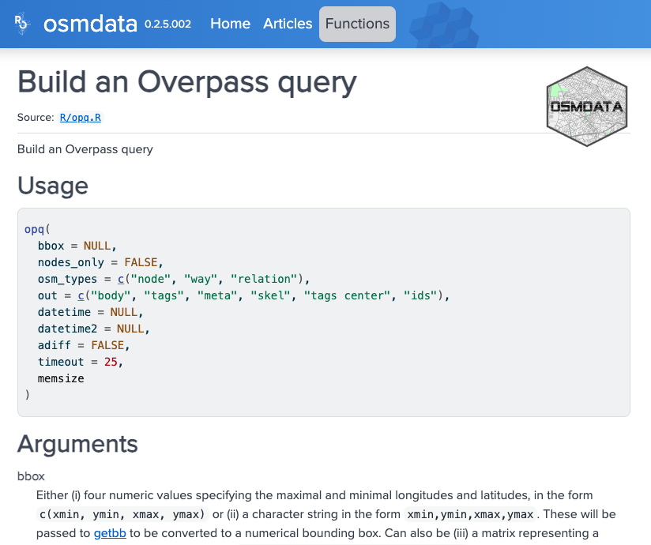

:::::::::::::::::::::::::::::::::::::: questions 

- How to import and work with vector data from OpenStreetMap?

::::::::::::::::::::::::::::::::::::::::::::::::

::::::::::::::::::::::::::::::::::::: objectives

After completing this episode, participants should be able to…

- Import OSM vector data from the API
- Select and manipulate OSM vector data
- Visualise and map OSM Vector data
- Use Leaflet for interactive mapping

::::::::::::::::::::::::::::::::::::::::::::::::

```{r setup, include=FALSE} 
knitr::opts_chunk$set(warning = FALSE, message = FALSE) 
```

## What is OpenStreetMap?

OpenStreetMap (OSM) is a collaborative project which aims at mapping the world and sharing geospatial data in an open way. Anyone can contribute, by mapping geographical objects they encounter, by adding topical information on existing map objects (their name, function, capacity, etc.), or by mapping buildings and roads from satellite imagery.

This information is then validated by other users and eventually added to the common "map" or information system. This ensures that the information is accessible, open, verified, accurate and up-to-date.

The result looks like this:


The geospatial data underlying this interface is made of geometrical objects (i.e. points, lines, polygons) and their associated tags (#building #height, #road #secondary #90kph, etc.).

## How to extract geospatial data from OpenStreetMap?

```{r message=FALSE}
library(tidyverse)
library(sf)
assign("has_internet_via_proxy", TRUE, environment(curl::has_internet))

```


### Bounding box

The first thing to do is to define the area within which you want to retrieve data, aka the *bounding box*. This can be defined easily using a place name and the package `osmdata` to access the free Nominatim API provided by OpenStreetMap. 

We are going to look at *Brielle* together. 

::::::::::::::::::::::::::::::::::::: callout

Beware that downloading and analysing the data for larger cities might be long, slow and cumbersome on your machine. If you choose another location to work with, please try to choose a city of similar size!

::::::::::::::::::::::::::::::::::::::::::::::::

We first geocode our spatial text search and extract the corresponding bounding box (`getbb`).

```{r nominatim}
library(osmdata)

bb <- osmdata::getbb("Brielle")
bb
```

::::::::::::::::::::::::::::::::::::: callout

### Overpass query unavailable without internet

If you encounter an error linked to your internet proxy ("Error: Overpass query unavailable without internet R"), run this line of code. It might not be needed, but ensures that your machine knows it has internet.

```{r}
assign("has_internet_via_proxy", TRUE, environment(curl::has_internet))
```

::::::::::::::::::::::::::::::::::::::::::::::::


### A word of caution

There might be multiple responses from the API query, corresponding to different objects at the same location, or different objects at different locations.
For example: Brielle (Netherlands) and Brielle (New Jersey)

{width=40%}

{width=40%}

By default, `getbb()` from the `osmdata` package returns the first item. This means that regardless of the number of returned locations with the given name, the function will return a bounding box and it might be that we are not looking for the first item. We should therefore try to be as unambiguous as possible by adding a country code or district name.

```{r bbox}
bb <- getbb("Brielle, NL")
bb
```


:::::::::::::::::::::::::::::::::::::::::::::::::::::::::::::::::::: instructor

If this does not work for some reason, the `nominatim_polygon` can be found in the data folder: "episodes/data/boundingboxBrielle.shp".

::::::::::::::::::::::::::::::::::::::::::::::::::::::::::::::::::::::::::::::::


## Extracting features

A [feature](https://wiki.openstreetmap.org/wiki/Map_features) in the OSM language is a category or tag of a geospatial object. Features are described by general keys (e.g. "building", "boundary", "landuse", "highway"), themselves decomposed into sub-categories (values) such as "farm", "hotel" or "house" for `buildings`, "motorway", "secondary" and "residential" for `highway`. This determines how they are represented on the map.


### Searching documentation

Let's say we want to download data from OpenStreetMap and we know there is a package for it named `osmdata`, but we don't know which function to use and what arguments are needed. Where should we start?

Let's check the documentation [online](https://docs.ropensci.org/osmdata/):

{width=80%}

It appears that there is a function to extract features, using the Overpass API. This function is `opq()` (for OverPassQuery) which, in combination with `add_osm_feature()`, seems to do the job. However, it might not be crystal clear how to apply it to our case. Let's click on the function name in the documentation to find out more.

{width=80%}


On this page we can read about the arguments needed for each function: a bounding box for `opq()` and some `key` and `value` for `add_osm_feature()`. Thanks to the examples provided, we can assume that these keys and values correspond to different levels of tags from the OSM classification. In our case, we will keep it at the first level of classification, with "buildings" as `key`, and no value. We also see from the examples that another function is needed when working with the `sf` package: `osmdata_sf()`. This ensures that the type of object is suited for `sf`. With these tips and examples, we can write our feature extraction function as follows:


```{r osm}
x <- opq(bbox = bb) %>%
   add_osm_feature(key = 'building') %>%
   osmdata_sf()
```


### Structure of objects

What is this `x` object made of? It is a data frame of all the buildings contained in the bounding box, which gives us their OSM id, their geometry and a range of attributes, such as their name, building material, building date, etc. The completion level of this data frame depends on user contributions and open resources. Here, for instance, the national [BAG](https://data.overheid.nl/dataset/10491-bag) dataset was used and it is quite complete, but that is different in other countries.


```{r strbuildings}
str(x$osm_polygons)
```


## Mapping 


Let's map the building age of post-1900 Brielle buildings.


### Projections

First, we are going to select the polygons and reproject them with the Amersfoort/RD New projection, suited for maps centred on the Netherlands. This code for this projection is: 28992.

```{r transform}
buildings <- x$osm_polygons %>%
  st_transform(.,crs=28992)
```

:::::::::::::::::::::::::::::::::::::::::::::::::::::::::::::::::::: instructor

If this does not work for some reason, the `buildings` can be found in the data folder: "episodes/data/dataBrielle.shp".

::::::::::::::::::::::::::::::::::::::::::::::::::::::::::::::::::::::::::::::::


### Visualisation

Then we create a new variable using the threshold at 1900. Every date before 1900 will be recoded as `1900`, so that buildings older than 1900 will be represented with the same shade.

Then we use the `ggplot()` function to visualise the buildings by age. The specific function to represent information as a map is `geom_sf()`. The rest works like other graphs and visualisation, with `aes()` for the aesthetics.

```{r map}
start_date <- as.numeric(buildings$start_date)
buildings$build_date <- if_else(start_date < 1900, 1900, start_date)

 ggplot(data = buildings) +
   geom_sf(aes(fill = build_date, colour=build_date))  +
   scale_fill_viridis_c(option = "viridis")+
   scale_colour_viridis_c(option = "viridis") +
   coord_sf(datum = st_crs(28992))
```

So this reveals the historical centre of Brielle (or the city you chose) and the various urban extensions through time.
Anything odd? What? Around the centre? Why these limits / isolated points?


## Replicability

We have produced a proof a concept on Brielle, but can we factorise our work to be replicable with other small fortified cities? You can use any of the following cities: *Naarden*, *Geertruidenberg*, *Gorinchem*, *Enkhuizen* or *Dokkum*.

We might replace the name in the first line and run everything again. Or we can create a function.
```{r reproducibility}
extract_buildings <- function(cityname, year=1900){
  bb <- getbb(cityname)
  
  x <- opq(bbox = bb) %>%
     add_osm_feature(key = 'building') %>%
     osmdata_sf()
     
  buildings <- x$osm_polygons %>%
    st_transform(.,crs=28992)
    
  start_date <- as.numeric(buildings$start_date)
  
  buildings$build_date <- if_else(start_date < year, year, start_date)
   ggplot(data = buildings) +
     geom_sf(aes(fill = build_date, colour=build_date))  +
     scale_fill_viridis_c(option = "viridis")+
     scale_colour_viridis_c(option = "viridis") +
     ggtitle(paste0("Old buildings in ",cityname)) +
     coord_sf(datum = st_crs(28992))
}

#test on Brielle
extract_buildings("Brielle, NL")

#test on Naarden
extract_buildings("Naarden, NL")

```

::::::::::::::::::::::::::::::::::::: challenge 

## Challenge: import an interactive basemap layer under the buildings with 'Leaflet' (20min)

Leaflet is a ["open-source JavaScript library for mobile-friendly interactive maps"](https://leafletjs.com/). Within R, the `leaflet` package allows you to build such interactive maps. As with `ggplot2`, you build a map with a collection of layers. In this case, you will have the leaflet basemap, some tiles, and shapes on top (such as markers, polygons, etc.). 

- Check out the [leaflet package documentation](https://rstudio.github.io/leaflet/) and [GDCU cheatsheet](https://github.com/ClementineCttn/r-geospatial-urban/blob/main/instructors/cheatsheet/GDCU_cheatsheet.pdf).
- Plot a basemap in Leaflet and try different tiles in the [basemap documentation](https://rstudio.github.io/leaflet/basemaps.html)
- Transform the buildings into WGS84 projection and add them to the basemap layer with the `addPolygons()` function.
- Have the `fillColor` of these polygons represent the `build_date` variable. See the [choropleth documentation](https://rstudio.github.io/leaflet/choropleths.html) and [GDCU cheatsheet](https://github.com/ClementineCttn/r-geospatial-urban/blob/main/instructors/cheatsheet/GDCU_cheatsheet.pdf) for how use to use fill colors in polygons. Tip: use the examples given in the documentation and replace the variable names where needed.

:::::::::::::::::::::::: solution 

## One solution
 
```{r leaflet}
#install.packages("leaflet")
library(leaflet)


buildings2 <- buildings %>%
  st_transform(.,crs=4326)

# leaflet(buildings2) %>%
#  addTiles() %>%
#   addPolygons(fillColor = ~colorQuantile("YlGnBu", -build_date)(-build_date))

 # For a better visual rendering, try:
  
leaflet(buildings2) %>%
  addProviderTiles(providers$CartoDB.Positron) %>%
  addPolygons(color = "#444444", weight = 0.1, smoothFactor = 0.5,
  opacity = 0.2, fillOpacity = 0.8,
  fillColor = ~colorQuantile("YlGnBu", -build_date)(-build_date),
  highlightOptions = highlightOptions(color = "white", weight = 2,
    bringToFront = TRUE))
```


:::::::::::::::::::::::::::::::::

::::::::::::::::::::::::::::::::::::: 

::::::::::::::::::::::::::::::::::::: keypoints 

- Use the `Nominatim` and `Overpass` APIs within R
- Use the `osmdata` package to retrieve geospatial data
- Select features and attributes among OSM tags
- Use the `ggplot`, `sf` and `leaflet` packages to map data

::::::::::::::::::::::::::::::::::::::::::::::::

